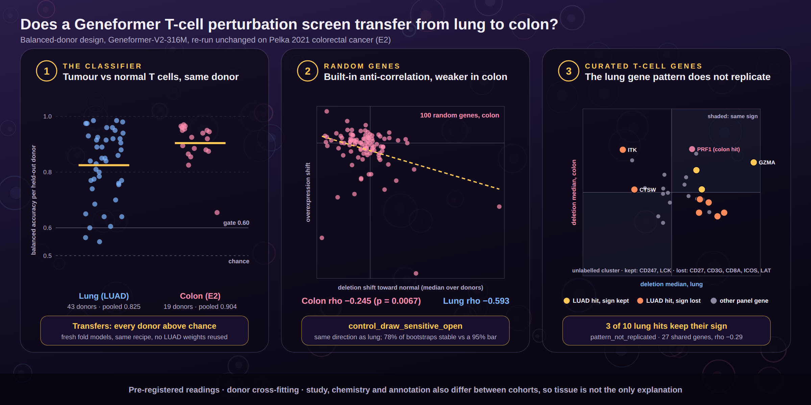
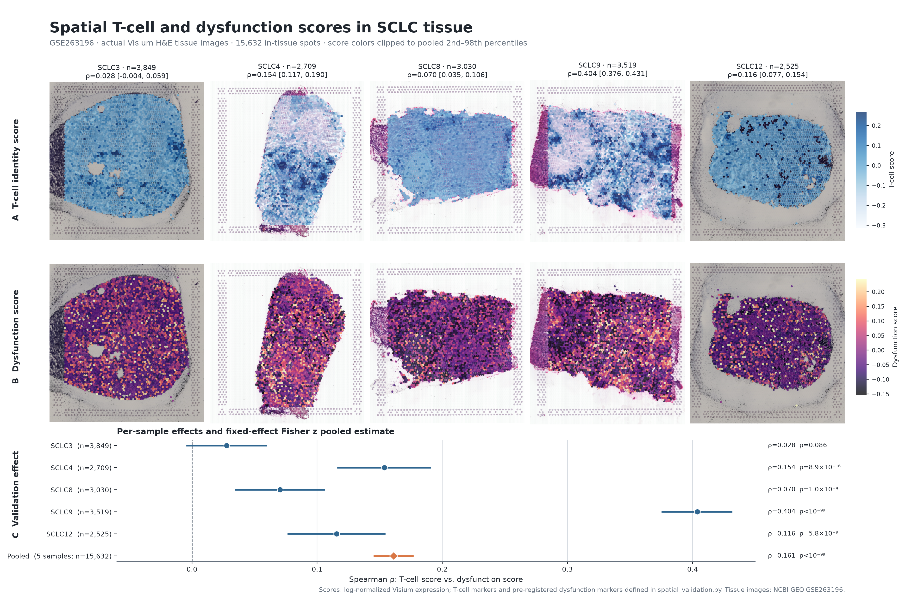
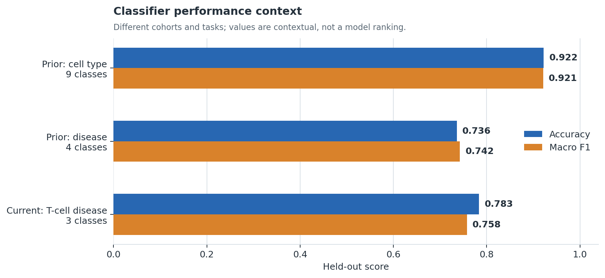
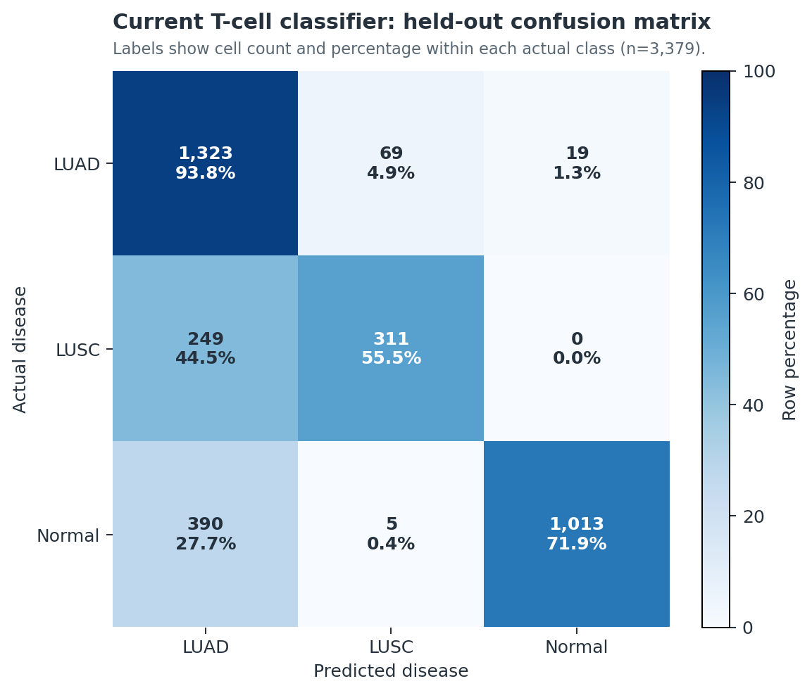
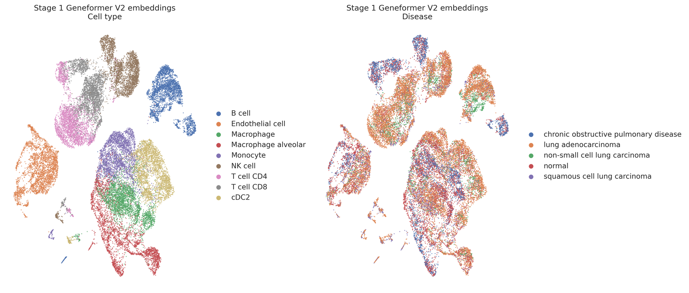
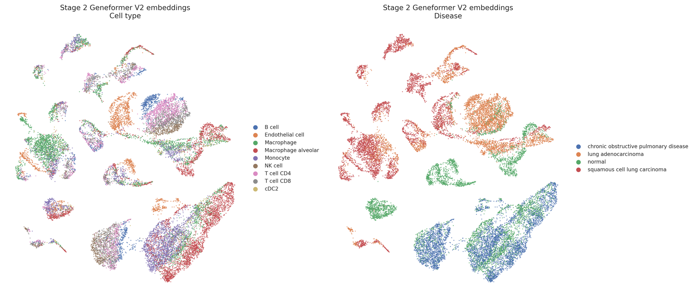

# Geneformer lung T-cell workflow (NSCLC + SCLC)

For moving the active Geneformer experiment, trained model, perturbation
outputs, and reporting environment to another machine, see the
[reproducible migration workspace](migration/README.md).

For creating a project-agnostic Geneformer environment with `uv` on a clean
machine, see the [general Geneformer + uv setup](geneformer_uv_setup/README.md).

## Poster — 24JSDP P25 (final)

[](snapshots/poster__poster_final.png)

A0 portrait, 841 × 1189 mm, one page. Every number on the sheet is read from a
result table at build time, so a rebuild after new analysis picks up new values.

The poster and talk sources are not published here, so this preview is the repository's
record of what was produced. The figures it is built from are tracked, and their
generators live in `tools/` and `sclc_validation/*/scripts/`.

### Updated review drafts — not the final poster or talk

The original final poster and talk remain unchanged. For review of the completed
T3/T4 immune-axis evidence, use these newly created, explicitly labeled drafts:

- [**UPDATED POSTER DRAFT — T3/T4 evidence review**](sclc_validation/immune_axis_test/UPDATED_POSTER_DRAFT.html)
- [**UPDATED TALK DRAFT — T3/T4 evidence review**](sclc_validation/immune_axis_test/UPDATED_TALK_DRAFT.html)

These drafts are not canonical deliverables and do not replace
`snapshots/poster__poster_final.png` or the existing talk deck. They present the
non-collinear geometry, the positive-but-null-inseparable exhaustion shift, and
the failed strict titration criterion without changing the approved wording.

## Latest studies: balanced-donor LUAD and E2 colorectal

This repository tests the evaluation criteria that the Geneformer protocol
([Zhang, Venkatesh & Theodoris, *Nature Protocols* 2026](https://doi.org/10.1038/s41596-026-01364-8))
uses for a fine-tuned classifier and its in silico perturbation: held-out-patient
classification, each gene's shift toward the goal state against random genes,
and candidate targets. Two pre-registered studies rebuilt the screen around
donor-paired tumour and normal T cells, then asked whether its results hold
outside lung. Both final reports passed independent review. The classifier
criterion held in both; the random-gene comparison and the candidate genes did
not.



| Study | Design | Result | Report |
|---|---|---|---|
| Balanced-donor LUAD, final 30 September 2026 | 43 lung adenocarcinoma donors; matched tumour and adjacent-normal T cells, equal cells per donor per tissue | The classifier separates tumour from normal T cells of the same donor: pooled held-out balanced accuracy 0.825, 43 of 43 donors above chance. Across random genes, deletion and overexpression shifts are anti-correlated (rho −0.593), so opposed effects in the two arms are the baseline expectation. 13 of 34 testable curated T-cell genes reach a stable, dose-concordant status | [`IMRAD_REPORT.md`](balanced_donor_luad/reports/IMRAD_REPORT.md) |
| E2, Pelka 2021 colorectal, final 2 October 2026 | The same design, unchanged, on 19 donors: tumour against normal colon | H2a PASS: balanced accuracy 0.904, 19 of 19 donors above chance. H2b `control_draw_sensitive_open`: rho −0.245 (p = 0.0067), the same direction as lung, but only 78% of gene bootstraps stay significant against a 95% bar. H2c `pattern_not_replicated`: 3 of 10 LUAD reference genes keep their deletion sign (p = 0.95), and PRF1 is the only dose-concordant gene in colon | [`geneformer-e2-pelka-20261002.md`](pelka_crc_e2/reports/geneformer-e2-pelka-20261002.md) |

A different result in colon cannot be put down to tissue alone. Study,
dissociation, chemistry, annotation, the null-gene population and the fold
models all differ, and 19 donors give less power per gene than 43.

**Next, E3 (designed, not yet run).** Both cohorts are cancer T cells, a setting
the protocol itself flags. E3 applies the protocol's criteria exactly as
published, next to this repository's donor-level tests, to T cells of the
protocol's own example atlas, the Chaffin et al. 2022 cardiomyopathy hearts. It
first checks that the pipeline reproduces the protocol's cardiomyocyte result
(macro F1 0.85, GSN). E3 is part of a planned cross-evaluation that scores the
protocol's criteria and this repository's own on each other's data: first on
the existing lung and colon outputs (CPU only), then on the protocol's
cardiomyocyte result, including whether its validated target GSN survives our
criteria. Nothing has run yet; the plan waits for a GO on the data download and
GPU time: [`EXECUTION_PLAN.md`](protocol_criteria_e3/EXECUTION_PLAN.md),
[`CRITERIA_INVENTORY.md`](protocol_criteria_e3/CRITERIA_INVENTORY.md),
[`BALANCED_CRITERIA.md`](protocol_criteria_e3/BALANCED_CRITERIA.md) (ISP-BAL-1, a balanced set built
from both, with executable checks and unit tests),
[`E3_DESIGN.md`](protocol_criteria_e3/E3_DESIGN.md).

This branch prioritizes the **17 July 2026** donor-held-out Geneformer workflow:
21,000 naturally balanced CD4/CD8 T cells, a three-state LUAD/LUSC/normal
classifier, and an all-gene in silico deletion screen.

**2026-09-24:** three established defects in how the LUAD/LUSC/normal classes
above were constructed — see
[`current_workflow/METHODS.md`, "Class-construction defects"](current_workflow/METHODS.md#class-construction-defects-established-2026-09-24)
for the record.

**Recent highlight:** the [SCLC validation program](#recent-highlight-sclc-validation-program)
extends the workflow to small cell lung cancer — feasibility audit, an
SCLC/LUAD/normal classifier with a targeted perturbation panel, and orthogonal
spatial validation.

## Current experiment

| Dataset | Donor control | Test performance | Perturbation |
|---|---|---|---|
| 7,000 LUAD + 7,000 LUSC + 7,000 normal; no oversampling | No donor crosses train/eval/test | Accuracy **0.7834**; macro F1 **0.7577** | **2,937,776** held-out cell-gene deletions complete; 6/6 comparisons generated |

See [`current_workflow/METHODS.md`, "Class-construction defects"](current_workflow/METHODS.md#class-construction-defects-established-2026-09-24)
for three established defects in how the LUAD/LUSC/normal classes above were
constructed, established 2026-09-24.

**Workflow:** atlas selection → donor-disjoint split → Geneformer V2 tokenization
→ fine-tuning → held-out evaluation → all-gene deletion.

[Overview](current_workflow/README.md) ·
[Methods](current_workflow/METHODS.md) ·
[Results](current_workflow/RESULTS.md) ·
[Live run status](current_workflow/monitoring/GPU_PROGRESS_REPORT.md)

## Recent highlight: SCLC validation program

Three-part extension of the T-cell workflow to small cell lung cancer:
**data feasibility audit → SCLC/LUAD/normal classifier + targeted perturbation
panel → orthogonal spatial validation.**

### Cohorts (feasibility audit: **GO, with conditions**)

| Source | Role | Content |
|---|---|---|
| HTAN/CELLxGENE T-cell object | Primary single-cell cohort | **46,140 T cells, 42 donors**: 11,791 SCLC (19 donors), 29,829 LUAD (22), 4,520 normal (4); all 21 pre-registered signature genes present |
| GSE263196 (10x Visium) | Orthogonal spatial validation | 5 SCLC samples, **15,774** in-tissue spots; all 21 signature genes present |
| OMIX002441 | Cross-platform sensitivity cohort | 1,039 T cells, 11 patients; all signature genes Geneformer-tokenable |

[Full audit report](sclc_validation/audit/SCLC_DATA_FEASIBILITY_AUDIT.md)

### SCLC/LUAD/normal T-cell classifier

Donor-disjoint split (leakage check **PASS**), Geneformer V2 104M fine-tune.
Held-out test: accuracy **0.919**, macro F1 **0.903**.

| Class | Precision | Recall | F1 | Test cells (donors) |
|---|---:|---:|---:|---|
| LUAD | 0.926 | 0.959 | **0.942** | 6,386 (4) |
| Normal | 0.847 | 0.986 | **0.911** | 566 (1) |
| SCLC | 0.922 | 0.800 | **0.857** | 2,424 (3) |

*Caveat: the normal class rests on a single test donor — a single-patient data
point, not a population estimate.*

### Targeted 50-gene perturbation panel

50 genes (21 pre-registered immune panel + 29 top drivers from the prior
screen), delete **and** overexpress, across all three source states — **300
gene-runs, all complete**. **123 concordant hits** (both arms FDR < 0.05,
opposite-sign shift); **43 fully donor-consistent**.

| Finding | Detail |
|---|---|
| Internal positive control | **ASCL1 / NEUROD1** (canonical SCLC master regulators) give the strongest concordant SCLC→LUAD signal — the pipeline recovers known tumor biology |
| Robust panel hits | TIGIT, GZMH, CCR7, NKG7, TCF7, IL7R, SLAMF6, CTLA4, HAVCR2, IFNG — exhaustion/cytotoxicity vs. progenitor axis, backed by 1,000+ detections |
| Caution flags | HBA1/HBB, HSPA1B, RPS26, S100A8/9 — contamination/stress candidates pending the biological evaluation pipeline |

[Workflow](sclc_validation/perturbation_workflow/README.md) ·
[Panel results](sclc_validation/perturbation_workflow/targeted_panel/RESULTS.md)

### Orthogonal spatial validation (GSE263196 Visium)

The pre-registered T-cell dysfunction signature is enriched in T-cell-rich SCLC
tissue regions: pooled **ρ = 0.161, 95% CI [0.146, 0.176]**, significant in 4 of
5 samples individually (p < 1e-3).

| Sample | Spots | ρ | 95% CI |
|---|---:|---:|---|
| SCLC3 | 3,849 | 0.028 | [-0.004, 0.059] |
| SCLC4 | 2,709 | 0.154 | [0.117, 0.190] |
| SCLC8 | 3,030 | 0.070 | [0.035, 0.106] |
| SCLC9 | 3,519 | **0.404** | [0.376, 0.431] |
| SCLC12 | 2,525 | 0.116 | [0.077, 0.154] |
| **Pooled** | **15,632** | **0.161** | **[0.146, 0.176]** |


[](sclc_validation/spatial_validation/figures/spatial_tissue_validation_panel.png)

[Spatial validation design and methods](sclc_validation/spatial_validation/README.md)

### Immune-axis validation

The follow-up immune-axis tests now include the completed T4 program-level
overexpression run: all **273/273** GPU units (program, nested-set, and
expression-matched null) completed with zero missing markers. The SCLC→LUAD
exhaustion shift is positive but is not separated from the matched null
(`p_directional = 0.4286`), and the nested titration is near- but not strictly
monotone. See the [T4 results](sclc_validation/immune_axis_test/RESULTS_T4.md)
and [analysis plan](sclc_validation/immune_axis_test/PLAN.md) for the
qualified interpretation; poster and talk wording remain unchanged pending
review.

## In silico perturbation concept


Each expressed gene token is deleted once, the fine-tuned model recalculates the
cell embedding, and movement is scored toward LUAD, LUSC, and normal reference
states. This image is conceptual; quantitative results come from the held-out
deletion screen.

## Key findings



The earlier whole-cohort classifiers and today's T-cell classifier address
different tasks; this chart provides context, not a head-to-head ranking.



The final model detects LUAD strongly. Its main limitation is LUSC recall, with
249 of 560 held-out LUSC cells called LUAD. This ambiguity is explicitly
considered when interpreting perturbation directions.

## UMAPs from prior fine-tuned models

| Stage 1: cell-type model | Stage 2: disease model |
|---|---|
|  |  |

Stage 1 embeddings organize strongly by cell identity. Stage 2 shifts the
representation toward disease structure while retaining overlap. These are
archived models and provide context for today's T-cell-specific workflow.

## Repository map

```text
current_workflow/               active fine-tuning, results, monitor, visuals
sclc_validation/                SCLC audit, SCLC/LUAD/normal perturbation, spatial validation
sclc_validation/immune_axis_test/  immune-axis tests, T2–T5 results, and T4 summaries
balanced_donor_luad/            balanced-donor LUAD study: registration, results, IMRaD report
pelka_crc_e2/                   E2 colorectal replication: registration, results, reports
protocol_criteria_e3/           E3 design: protocol criteria in T cells of the Chaffin heart atlas
docs/graphical-abstract/        graphical abstract and its generator
archive/prior_nsclc_workflow/   Step1-Step7 notebooks and earlier evidence
requirements.txt                lightweight environment specification
```

Large atlases, tokenized datasets, embeddings, checkpoints, and model weights
remain outside Git.

For a searchable catalog of every existing and explicitly planned script, see the
[scripts reference](docs/scripts-reference.html). Each entry records its status,
inputs, outputs, dependencies, and expected outcome; planned items are labeled
separately from runnable code.
