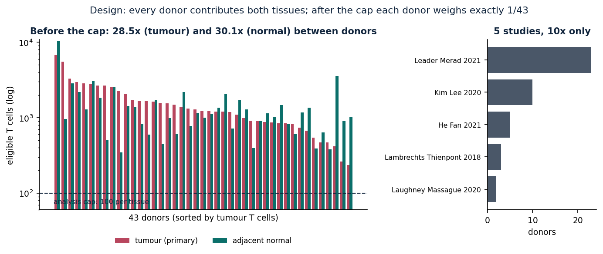
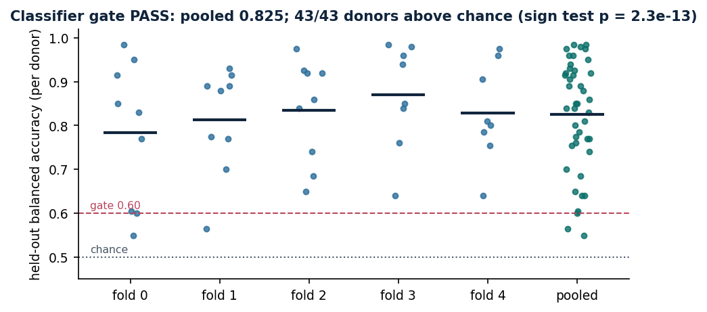
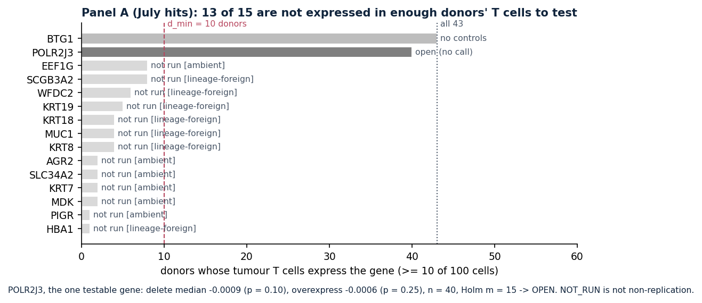
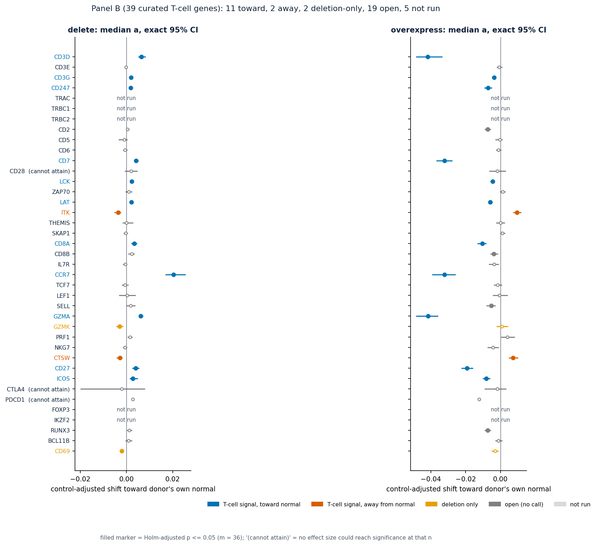
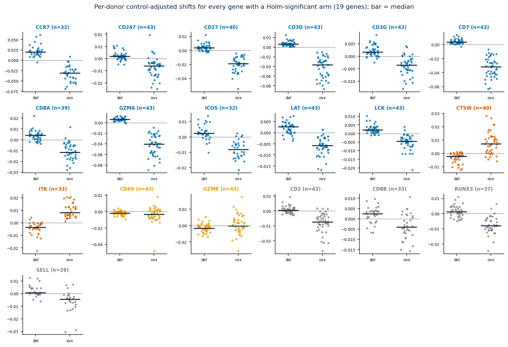
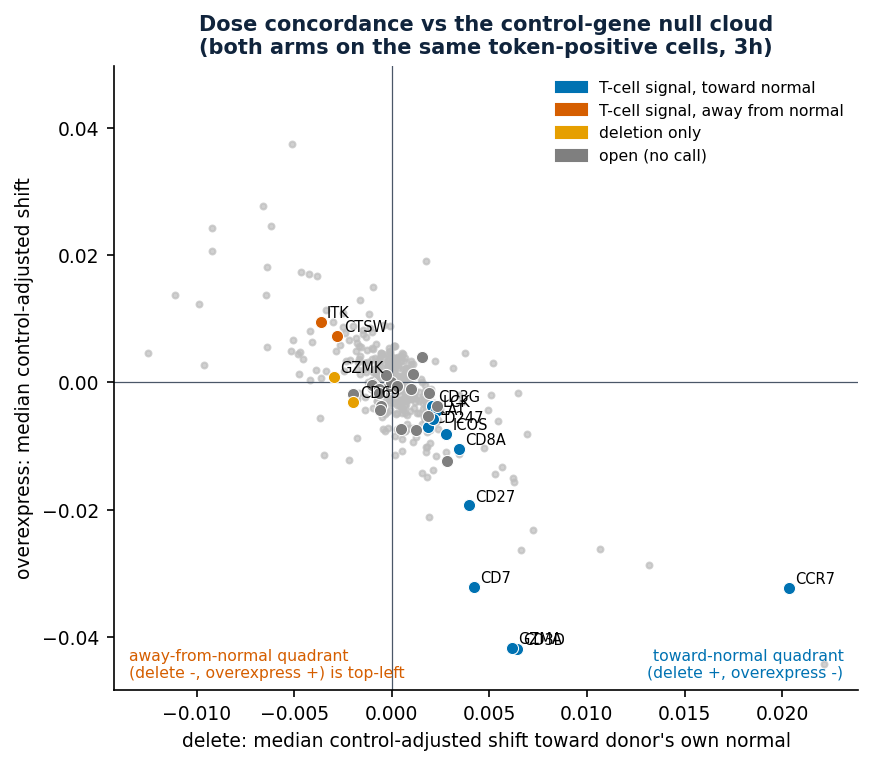
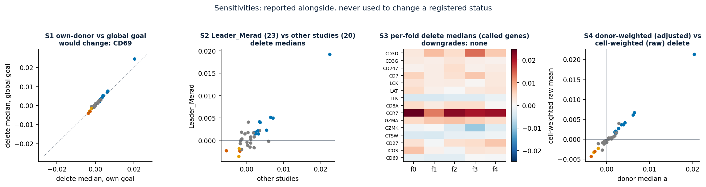

# Balanced-donor LUAD T cells: in silico perturbation results (Geneformer V2-316M, bf16)

Branch `analysis/balanced-donor-luad`. Registration: `registration/PHASE5_ISP_REGISTRATION.md` (Phase 5 plus Amendments 1–3h). Results: `phase7_results/`. Figures: `figures/` (made by `scripts/make_figures.py` from committed files only).

## Plain-language summary

- **What we asked.** Tumour and adjacent-normal T cells were taken from the **same 43 lung-adenocarcinoma patients**, with exactly 100 cells per patient per tissue. For each tumour T cell we asked a foundation model whether removing a gene, or pushing it to the top of the cell's gene list, makes the cell look more like that **same patient's** normal-tissue T cells. Each answer is compared with 20 matched "control" genes and tested across patients.
- **The July LUAD hits (Panel A) are mostly not testable in T cells.** 13 of the 15 are keratins, mucin, a secretoglobin, a haemoglobin chain and other epithelial or blood markers. In this design they are expressed in the T cells of at most 8 of 43 patients, so they were not run. **This is not a failed replication.** It shows the July list was mostly not T-cell biology. The one testable gene, POLR2J3, shows no effect.
- **The curated T-cell genes (Panel B) give a consistent signal for 13 of 34 tested genes.** 11 of them, including CD3D/CD3G/CD247, LCK, LAT, CD8A, CCR7, GZMA, CD27 and ICOS, move tumour T cells toward normal when deleted and away when overexpressed; ITK and CTSW do the reverse. **None of these 13 statuses changes under any registered sensitivity.**
- **Read the effect sizes with caution.** Arbitrary matched control genes show the same delete-versus-overexpress shape (Spearman ρ = −0.62 across 360 control entries), and most called genes sit inside the controls' spread. Only CCR7, CD3D, GZMA and CD7 stand clearly outside it. This comparison is descriptive and post hoc; see §4.
- **Checkpoint genes cannot be judged here.** CTLA4 (6 patients), PDCD1 (5) and CD28 (9) were tested on fewer donors than the design minimum of 11, and in this analysis they **cannot reach significance at any effect size**. For them this is no evidence either way, not evidence of no effect.

---

## 1. Design and gates

**Cohort.**
- 43 donors, each contributing both `tumor_primary` and `normal_adjacent` CD4/CD8 T cells, from LuCA extended (CELLxGENE `33165751`, 10x only).
- The donors come from 5 studies: Leader_Merad 23, Kim_Lee 10, He_Fan 5, Lambrechts 3, Laughney 2.
- Before the 100-cell cap, T-cell counts differed 28.5× between donors (tumour) and 30.1× (normal). After the cap, every donor weighs exactly 1/43.

**Model and folds.**
- Geneformer V2-316M in bf16, fine-tuned as a 2-class classifier (tumour vs normal).
- 5-fold donor cross-fitting, so each donor is scored by the fold model that never saw it.

**Classifier gate: PASS.**
- Pooled held-out balanced accuracy is **0.825**. Per fold it ranges from 0.784 to 0.869.
- **43/43 donors are above chance** (exact sign test p = 2.3 × 10⁻¹³).
- The fine-tune nondeterminism band (0.045 per donor, measured from one same-seed repeat) cannot flip the gate: 0 donors can be flipped, and the pooled value is not within the band of the 0.60 threshold.

**Pre-analysis gates.** Phase 7 refuses to start unless every gate in `registration/required_gates.json` is satisfied. All 13 were satisfied at launch (`b62a12a`):
- the classifier gate;
- ambient classification produced;
- the no-op gate;
- cross-host equivalence before delete and before overexpress;
- end-of-run equivalence exists;
- wrapper equivalence;
- token-edit verification;
- Amendments 3g and 3h registered;
- analysis rules frozen byte for byte;
- overexpress count checks;
- overexpress identity check.

**End-of-run equivalence (s.3.5): PASS for both operations.**
- The probe (B2M, He_Fan_2021_P1) was re-run twice per host after Phase 6 finished.
- The result is bit-identical across hosts (max|Δ| = 0.0), and every pickle's sha256 equals the pre-run probe's.
- So **`host_drift = false` on every row.**
- The comparator was shown afterwards (a late control, run after the gate had passed) to detect a planted +1×10⁻⁶ change in one cell and to fail on +2×10⁻³ and on reordering. The 0.0 is therefore a measured absence of difference, not an untested instrument.

## 2. Panel A — the July LUAD→normal hits

| Outcome | Genes |
|---|---|
| NOT_RUN (estimable donors < d_min = 10) | PIGR 1, HBA1 1, AGR2 2, KRT7 2, MDK 2, SLC34A2 2, KRT18 4, KRT8 4, MUC1 4, KRT19 5, WFDC2 6, EEF1G 8, SCGB3A2 8 |
| NOT_ESTIMABLE_CONTROLS | BTG1: its matched-control stratum had fewer than 20 candidates |
| OPEN | **POLR2J3** (n = 40): delete median −0.0009 (p = 0.10), overexpress −0.0006 (p = 0.25), Holm m = 15, adjusted p = 1 for both |

**NOT_RUN is not non-replication.**
- A gene is estimable in a donor only if its token is present in at least 10 of that donor's 100 tumour T cells.
- The 13 NOT_RUN genes fall short in almost every donor: they are epithelial, secretory or blood markers. Six are ambient-flagged and seven are curated lineage-foreign.
- A balanced-donor T-cell design did not refute the July panel. **It showed the panel is mostly not testable in T cells at all.** This fits the earlier finding that the July screen's top list was mostly not T-cell biology (PR #16).
- POLR2J3 is the only testable gene, and it gives no call. Per Amendment 2, which applies because the 104M arm was excluded by directive, a Panel A non-replication would read "non-replication on 316M; model-vs-design attribution not established". **No Panel A gene reached that point.**
- The Panel A secondaries (floor 12 eligible genes) are not run (n_eligible = 1).

## 3. Panel B — curated T-cell genes

| Status | n | Genes |
|---|---|---|
| T_CELL_SIGNAL_TOWARD | 11 | CD3D, CD3G, CD247, CD7, LCK, LAT, CD8A, CCR7, GZMA, CD27, ICOS |
| T_CELL_SIGNAL_AWAY | 2 | ITK, CTSW |
| DELETION_ONLY | 2 | GZMK, CD69 |
| OPEN | 19 | CD3E, CD2, CD5, CD6, CD28, ZAP70, THEMIS, SKAP1, CD8B, IL7R, TCF7, LEF1, SELL, PRF1, NKG7, CTLA4, PDCD1, RUNX3, BCL11B |
| NOT_RUN | 5 | FOXP3, IKZF2 (0 estimable donors); TRAC, TRBC1, TRBC2 (not in the V2 token dictionary) |

- **Stability comes first.** No status among the 13 coherent genes (11 TOWARD, 2 AWAY) moves under either registered alternative rule (3g.4), under all-cells overexpress (sensitivity B), under the global goal (S1), or under fold heterogeneity (S3: no downgrades).
- **Three other rows are fragile, and say so in their own line:**
  - GZMK: DELETION_ONLY → T_CELL_SIGNAL_AWAY under all-cells overexpress (B);
  - PRF1: OPEN → DELETION_ONLY if any control with ≥ 1 cell counts (3g rule 1);
  - CD69: DELETION_ONLY → DOSE_INCOHERENT if Holm m counts only tested genes (3g rule 2), and also under the global goal (S1).
- **Rows tested below the design minimum.** The pre-registered, design-level criterion is n < d_min = 11 (s.4). It flags **CD28 (n = 9), CTLA4 (6), PDCD1 (5) and LEF1 (10)**, and it is the headline criterion.
  - These genes had 18, 14, 13 and 21 estimable donors.
  - Donors were then dropped by the registered 3g.1 rule, which needs ≥ 10 of 20 controls estimable in the same donor.
- **Post hoc, conditional on the observed family: cannot attain significance at any effect size.** This check substitutes the minimum exact p (2/2^n) into the realized Holm family and depends on the other genes' observed p-values. It is **not** the registered criterion.
  - **CD28**: best possible Holm p 0.07 / 0.08.
  - **CTLA4**: 0.50 / 0.59.
  - **PDCD1**: 0.94 / 1.0.
  - Each of these three is "OPEN, cannot attain significance at this n: no evidence either way".
  - **The two criteria flag four genes and three genes, and LEF1 is the only disagreement.** Neither count is wrong: they measure different things. LEF1 is below the registered design floor, but it could still have reached significance given how the rest of the family landed (many genes are highly significant, so its Holm step is loose). That single disagreement is why both criteria are reported.
- **Four OPEN genes are overexpress-significant only:** CD2, RUNX3, SELL and CD8B (Holm p 1.5×10⁻⁹, 2.4×10⁻⁷, 0.010 and 0.032). One significant arm is not a call; the registration requires both.
- **TRAC, TRBC1 and TRBC2** are NOT_RUN because their Ensembl IDs (ENSG00000277734, ENSG00000211751, ENSG00000211772) are **not among the 20,275 keys of the Geneformer V2 token dictionary**. The model cannot see or perturb them. That is a property of the model, not of these cells. Why the dictionary omits the TCR constant genes is not established here. These three rows were registered in s.1b before any GPU run (39 listed, 36 perturbable).
- **Panel-level secondary.** 21 of 34 tested genes point toward normal on deletion and 13 away (sign test p = 0.23). **Genes in one stratum share their 20 controls (Amendment 3c.2), so these signs are not independent, and the sign test assumes they are.**

## 4. Dose concordance and the control genes

**How each arm is measured (Amendment 3h).**
- Deletion and overexpression are both measured on the **same token-positive cells** of each donor.
- Geneformer perturbs every cell for overexpression but only token-positive cells for deletion. The token-positive subset of each overexpress pickle was therefore reconstructed by replaying Geneformer's own filter and stable length sort.
- Two count checks passed on all 15,142 gene-donor pairs.
- **A GPU identity check on 8 frozen control pairs was bit-identical** (max|Δ| = 0.0): the reconstruction selects exactly the cells a token-positive-only run perturbs, including across length ties (80.5% of pairs have one).
  - The tie-free pairs came out at k = 99 under the registered "largest k" rule. They exclude only one negative cell each, so they were **never needed as a control**: nothing failed, and the tie-rich pairs are the hard case.
- Bit identity was registered as not expected, because padding differs between runs, and was observed anyway. It is reported as a measured result.
- `design.json` was byte-identical between the refused first launch and the run. So the 3h ruling changed the measurement, not the design.

**The grey cloud (post hoc, descriptive, not a registered test).**
- For each of the 360 control entries (control gene × stratum), the donor-median delete and overexpress shifts were computed, each adjusted by the other 19 controls under the same 3g.1 rules.
- **The controls are anti-correlated too** (Spearman ρ = −0.62), and 35% of them lie in the toward-normal quadrant. Opposite-signed delete and overexpress shifts are a generic property of perturbing an expressed gene in this model, not a T-cell signature.
- Measured against the controls' spread, the share of controls with an effect at least as large is:

| Gene | Delete | Overexpress |
|---|---|---|
| CCR7 | 0.3% | 0.6% |
| CD3D | 4.2% | 0.3% |
| GZMA | 5.6% | 0.3% |
| CD7 | 10.0% | 0.6% |
| CD27 | 10.8% | 3.1% |
| Others among the 13 | 12–23% | 11–43% |

**Reading.**
- The registered statuses stand. They answer "is this gene's shift consistent across donors, relative to its own matched controls".
- "This gene is special among genes" is a different claim, and only CCR7, CD3D, GZMA and CD7 (and CD27 on overexpression) support it on effect size.
- **This narrows what the registered result licenses; it does not overturn it.** It has the same shape as the S100A8/A9 finding (PR #16): there, an FDR of 1e-224 was a certainty claim, not a size claim. Here, **concordance is a direction claim, not a distinctiveness claim**, because the controls are concordant too. In both cases the null was what had not been drawn.
- **The earlier whole-genome screen does not supply this null**, but it points the same way. It is committed at `sclc_validation/primary_test_perturbation/tables/allgene_delete_overexpress_shift.csv`: 104M fp32, class-centroid goal, cell-weighted, token-positive on both arms. Across genes with ≥ 25 detections, its delete and overexpress shifts are also anti-correlated, weaker than here (Spearman ρ −0.08 to −0.30 across its six comparisons, about half of genes opposite-signed). A null for this design (316M, donor-own goal, control-adjusted, per donor) would need new GPU time. Whether to run it is the human's decision.

## 5. Sensitivities

- **S1, global goal instead of the donor's own normal:** delete medians agree closely; the only status that would change is CD69 (see §3).
- **S2, Leader_Merad (23) vs the other studies (20):** signs differ only for OPEN genes and for GZMK's overexpress arm. **None of the 13 coherent genes differs.**
- **S3, per-fold delete medians:** no downgrades.
- **S4, cell-weighted raw vs donor-weighted adjusted:** these agree in sign and rank. Donor weighting equals cell weighting by construction (100 cells per donor).
- **3f, classifier accuracy vs effect (descriptive):**
  - Panel B panel-median per donor vs per-donor balanced accuracy: ρ = 0.13 (delete) and 0.14 (overexpress).
  - Panel A has one gene, so its ρ (0.14 / −0.38) is a single-gene correlation.
  - The per-donor value is a median over a varying number of genes (13–34).

## 6. Interpretation breakdown: what each status licenses

| Status | Licenses | Does **not** license |
|---|---|---|
| T_CELL_SIGNAL_TOWARD / AWAY | In this model, deleting and overexpressing the gene move tumour T cells in opposite directions relative to the same donor's normal T cells, consistently across donors and beyond matched controls (Holm, both arms) | That the gene drives tumour-vs-normal T-cell state in biology; that its effect is unusual among genes (see §4); anything about non-T cells |
| DELETION_ONLY | A consistent deletion effect; the dose direction is unresolved | Concordance; a "signal" claim |
| DOSE_INCOHERENT | Both arms move the same way, so the model is not responding to dose direction | Any directional claim |
| OPEN | The registered test did not call it | Absence of effect; for CD28, CTLA4 and PDCD1 it is **no evidence either way** |
| NOT_RUN | The gene is not expressed in enough donors' T cells (or is not in the model's vocabulary) | Non-replication; no effect |
| NOT_ESTIMABLE_CONTROLS | No valid matched controls | Anything about the gene |

## 7. Limitations

- **Within-donor ambient contamination.** Tumour and normal tissue differ in ambient RNA, and pairing cannot remove that. Panel A's ambient labels are shown, but no Panel A gene reached a call.
- **Model change.** 104M fp32 (July) was replaced by 316M bf16, by directive. There is no 104M arm (Amendment 3), so any Panel A non-replication could not be attributed to design vs model. This is moot here, since none occurred.
- **Overlapping donors.** 20 of the 43 are among the core atlas's LUAD donors that July sampled from, so this is not an independent cohort.
- **Selection** toward T-cell-rich samples (≥ 100 T cells in both tissues). 17 LUAD donors with only one qualifying tissue were excluded.
- **Classifier nondeterminism.** The fine-tune is not bit-reproducible (band 0.045 per donor from one repeat). Deterministic kernels and reruns were ruled out. The gate is far from the threshold, but the downstream ISP inherits the specific fold models.
- **Shared controls.** Genes in a stratum share 20 controls (3c.2), which affects the panel-level secondary.
- **Unpassable rows.** CD28, CTLA4 and PDCD1 cannot reach significance: donors were lost to the 10-of-20 control rule, whose 10-of-20 threshold is a convention without a principled basis (3g.1).

## 8. Process record (ordering, amendments, errors)

- **Late checks.** The no-op gate and the native-vs-wrapper equivalence were **run after Phase 6 had started**, not before as the plan said. Both passed (`phase6_prep/pre_isp_gates_late.json`). Token-edit verification was an unregistered addition, also late. The `probe_cmp` negative control was run after the end gate had passed.
- **Amendment 3g (before any Phase 6 output was read):**
  - control estimability per donor;
  - Holm m = full panel (15 / 36);
  - the 3f panel value;
  - the sensitivity line.
- **Amendment 3h (after Phase 6, before any outcome value was read):**
  - The first Phase 7 launch refused at the loader for two reasons:
    - (i) my bug: it requested the 15 never-run panel genes;
    - (ii) Geneformer overexpresses all 100 cells, not only token-positive ones. That library behaviour had been documented in this repository on 2026-09-22 (card `isp-runner-paired-arms-20260922`) and was missed.
  - The ruling: token-positive cells for both arms, with all-cells as a labelled sensitivity.
  - An instruction to refuse on any length tie was **withdrawn** as keyed to the wrong condition.
  - The synthetic tests had encoded the wrong assumption, so only real data caught it.
- **Summary field names that understate what they count:**
  - `controls/pre_gpu_summary.json` `genes_to_run: 354` counts genes *assigned* to hosts, including BTG1, which was never run. 353 were run.
  - `panel_B_total: 36` counts *perturbable* Panel B genes; 39 are listed and reported.

  Both committed files are left unedited.
- **Reporting gap.** Tested rows in `outcome_rows.json` do not carry `estimable_donors`, which 3g.1 asks for. It is supplied in `phase7_results/row_annotations.json`, appended with the attainability flags. The rows themselves are unedited, and no status depends on the field.
- **Phase 6 was run in three segments.** Two CPU-side performance fixes were applied between them (model-cache fingerprinting; the single-process map), and byte identity to the earlier code was shown on 24 stored pickles. No rerun of the model arithmetic was involved.

## 9. GPU-hours

| Stage | GPU-h |
|---|---|
| Phase 4 fine-tunes (attempt 1, crashed, 0.63; attempt 2, 3.22) | 3.85 |
| Goal embeddings | 0.42 |
| Pre-run equivalence probe (3e.3) | 0.06 |
| Phase 6, thinkstation1 (0.389 + 0.386 + 13.472) | 14.25 |
| Phase 6, thinkstation2 (0.391 + 0.386 + 14.240) | 15.02 |
| End-of-run probes, identity check, late gates, resume and spot tests | ≈ 0.2 (not metered individually) |
| **Total** | **≈ 33.8** |

- The plan estimated **~31 GPU-h** as an upper bound, of which Phase 6 was 27.8. **Phase 6 used 29.27 (+5%); the total is about +9%.**
- Phase 6 time is the driver's wall-clock per segment. The idle gaps between segments are not counted.
- The 06:05–07:05Z slowdown had two shapes:
  - thinkstation1 dipped about 9.5% for one hour and recovered;
  - thinkstation2 dipped about 5.8% and then ran about 6% below its opening rate for three more hours.

  It was not investigated.
