# Balanced-Donor LUAD Tumor-vs-Normal T-Cell In Silico Perturbation Study

**Status: complete draft, pending the independent gatekeeper's final read before this reaches the
human.** All analysis outputs cited below have been checked by that gatekeeper (Stanley), including an
independent full recomputation of the null study's statistics from saved intermediate data, and are
reported using his required wording where the null study is concerned: the null study's gene population
is described as random eligible genes detectable in LUAD tumor T cells, never as genome-wide; its
p-values are reported at the permutation floor rather than as an exact figure; the N=200 result is
described as confirming the N=100 primary, never as an independent replication; and the R3 validity
check against the study's own matched controls is compared by sign only, never by magnitude.

Repository: `Kays3/geneformer-lung-tcell`. This document lives on branch
`report/imrad-balanced-donor-null` and is built from the registration documents, commit history, and
run artifacts cited inline, so a reader can check any design number against its source independently
of this prose.

---

## Abstract

Geneformer, a foundation model for single-cell transcriptomes, was used to ask whether an earlier,
weakly controlled screen's findings survive a donor-paired redesign, and whether the same pipeline
shows a directional artifact even on genes with no connection to the biology in question. Forty-three
lung adenocarcinoma patients each contributed matched tumor and adjacent-normal T cells, with cell
counts capped equally per donor per tissue to remove a 28 to 31-fold imbalance present in the raw data.
A donor-stratified classifier separating the two tissues reached a pooled held-out balanced accuracy of
0.825, with every one of the 43 donors scored above chance. Of the 15 genes carried over from the
earlier screen, 13 were not expressed in enough donors' T cells to test at all, one showed no call, and
the screen's list turned out to describe epithelial and blood-lineage biology rather than T-cell
biology in this cohort. A curated panel of 36 T-cell genes gave a stable, cross-validated concordance
for 13 genes: deleting each one shifted tumor T cells toward the same donor's normal profile, and
overexpressing it shifted them away, a pattern that held under every registered robustness check. This
same directional concordance, however, was not unique to biologically relevant genes. Applying the
identical pipeline to 100 randomly drawn, independently eligible genes gave a significant negative
correlation between deletion and overexpression shifts (Spearman rho = -0.593, one-sided p at the
permutation floor of the 100,000-permutation test), and the finding held, and strengthened slightly,
when the sample was extended to 200 genes under a pre-registered nested design (rho = -0.608, again at
the permutation floor). A validity check on the study's own 318 matched control genes recovered a
correlation of the same sign. Together these results indicate that opposite-signed deletion and
overexpression effects are a common property of this model and this experimental design, not a marker
of T-cell-specific biology, which narrows what the 13-gene concordance in the curated panel can be
taken to show without overturning the finding itself.

---

## 1. Introduction

Geneformer is a transformer model pretrained on single-cell transcriptomes. In silico perturbation
(ISP) uses it to estimate how forcing a gene's rank down (deletion) or up (overexpression) in a cell's
input token sequence shifts that cell's embedding toward or away from a target biological state. An
earlier screen over the Lung Cancer Atlas (LuCA) core atlas, referred to here as the July analysis, ran
an all-gene deletion screen against a three-class classifier (LUAD tumor, LUSC tumor, normal) built
from CELLxGENE's own disease labels. Read-only inspection on 2026-09-24 found that class definition to
be weaker than it first appears. The "normal" class drew from six non-cancer studies that contributed
no tumor T cells at all, so it was confounded with study identity rather than being a clean within-
population contrast. The "LUAD" class was selected by disease label alone, and in the core atlas that
label spans tumor, adjacent-normal, metastatic, and non-cancer tissue from LUAD patients, so the class
likely mixed several tissue sites without the mixing being visible in the label itself. Twenty of the
43 donors used in the present study overlap the donor pool the July screen drew its LUAD class from,
so the people are not new even though the design is.

The present study asks a narrower version of the July question. For each donor, does the model read a
consistent shift between that donor's own tumor tissue and their own adjacent-normal tissue, with every
other axis, study, chemistry, donor identity, and cell count, held equal between the two arms of the
comparison? Pairing within donor cancels study and chemistry by construction. A fixed per-donor,
per-tissue cell cap removes a raw 28 to 31-fold imbalance in cell counts across donors that existed
before capping (provenance table, row P1). Three questions follow from this design. The first, Panel A,
asks whether the 15 top LUAD-to-normal deletion hits from the July screen replicate under the
donor-paired design, in both the deletion and overexpression directions. The second, Panel B, asks
whether the model reads any T-cell-intrinsic signal on a curated panel of 36 canonical T-cell genes
that the July screen never ranked highly. The third is a null study: ranging over eligible random genes
detectable in LUAD tumor T cells, a population bounded by detectability in this cohort rather than
"genome-wide" in the usual sense (ISP-STD-1 B.9), does the same delete-overexpress raw-shift pipeline
show a systematic negative concordance even for genes with no a priori relationship to the tumor-normal
axis? A negative answer would suggest that any concordance seen in Panel A or B reflects gene-specific
biology rather than an artifact of the pipeline itself; a positive answer would narrow what such a
finding licenses.

All work after 2026-09-28 (13:35 JST) follows ISP-STD-1 v1.1, the floor standard the human adopted for
every in-silico-perturbation study going forward (`hive/standards/isp-outcome-criteria.md`). Its fixed
outcome vocabulary, `positive`, `negative`, `opposite_direction`, `not_estimable`,
`control_draw_sensitive_open`, `no_op_failed`, `not_run_by_design`, and `stopped_not_analysed`, is used
throughout this report. "No effect" is never substituted for `negative`, and "genome-wide" is never
substituted for "eligible random genes detectable in LUAD tumor T cells." Work completed before
2026-09-28 (Phases 4 through 7, described below) was not retroactively re-gated against ISP-STD-1,
consistent with the standard's own adoption note, though it already satisfied most of the standard's
requirements by construction: matched controls, a no-op gate, donor-level rather than cell-level
statistics, hash-pinned code and data, and ambient-signal flagging by leave-one-anchor-out.

---

## 2. Methods

### 2.1 Data source and cohort (Phases 0 through 3)

The data source is the single-cell Lung Cancer Atlas, extended atlas (Salcher et al., *Cancer Cell*
2022), CELLxGENE dataset version `33165751-ae33-4a65-94ee-52d9bc38f97e`, 1,283,972 cells across 17,764
genes with raw integer counts. It was downloaded on 2026-09-24 and verified against the published
object by S3 multipart ETag match and a full-file sha256 (`f0f7f43413bfe088281ac68487ad4bd73647d90572
80da202a82fabce9937cb9`; provenance row P2).

Donor and cell selection followed a mechanical rule fixed before any screening
(`provenance/PHASE0_SELECTION_RULE.md`, committed `3af3ca98` on 2026-09-24 at 18:19 JST, amended
`8ea11784` the same day to require a donor-level primary analysis, at least six paired donors held out,
and at least twelve eligible genes). The rule restricted disease status to lung adenocarcinoma, cell
type to CD4 and CD8 T cells (singlets, by the atlas's own `cell_type_major` label), chemistry to 10x
(3′ v2, with one contributing study also on 5′ v1), and tissue site to primary tumor versus
adjacent-normal only, excluding metastases, effusions, blood, and lymph nodes. A donor qualified only
if at least 100 T cells were available in both tissues.

This left 43 donors with both tissues represented, drawn from five studies: 23 from Leader_Merad 2021,
10 from Kim_Lee 2020, 5 from He_Fan 2021, 3 from Lambrechts_Thienpont 2018, and 2 from
Laughney_Massague 2020. Before any capping, 132,619 T cells met the eligibility rule, with donor-level
cell counts ranging from 237 to 6,764 in tumor tissue and 345 to 10,384 in adjacent-normal tissue, a
28 to 31-fold imbalance across donors. A fixed-seed draw (seed 20260924) then fixed exactly 100
analysis cells per donor per tissue (8,600 cells total, so every donor contributes an equal share) and
up to 300 pool cells per donor per tissue for training (25,700 cells total). Cells were tokenized for
Geneformer V2 with a median of 755 tokens per cell; the observed maximum of 2,656 tokens falls well
inside the model's 4,096-token context, so no truncation occurred. This cohort was committed on
`analysis/balanced-donor-luad` at `3af3ca98` (provenance row P3).

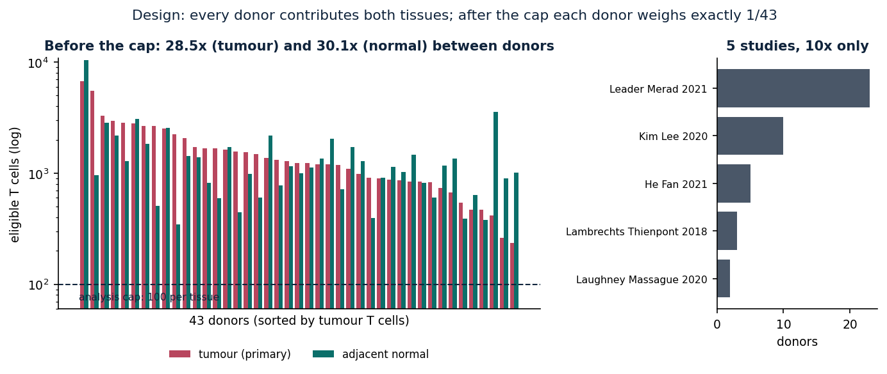

*Figure 1. The paired-donor design: per-donor T-cell counts before the 100-cell cap (a 28 to 31-fold
range across donors) and after it (every donor weighs exactly 1/43). Source:
`balanced_donor_luad/scripts/make_figures.py`, committed `a6bf6d0` on `main`.*

Three groups of cells were excluded, and the reasons are worth stating plainly rather than glossing
over. LUSC tumor tissue was excluded because only 9 donors qualify on 10x chemistry within LuCA,
short of the registered floor of 12; a broader public-data survey for a third class was scoped as a
possible follow-on (an early draft of Amendment 3) but was superseded once the human settled on the
registered two-class design (`e1a3ed94`, 2026-09-24 at 19:51 JST). Seventeen LUAD donors with only one
qualifying tissue were dropped, since the design requires both tissues from the same donor. And the
cohort as a whole is biased toward donors with more T-cell infiltration, because the donor rule
requires at least 100 T cells in both tissues; this selection effect cannot be removed by the pairing
design and is carried forward as a limitation (Section 5).

### 2.2 Model and fine-tuning design (Phase 4)

The model is Geneformer-V2-316M in bf16 precision, per the human's directive; no 104M arm was run in
parallel, a deliberate design choice registered in advance rather than an oversight (Amendment 1 and 2,
`e2e10421` and `f5805cbc`, both 2026-09-24). Because that comparison arm does not exist, any Panel A
non-replication is reported with a caveat fixed in the registration before any output existed: that a
non-replication on 316M does not by itself establish whether the cause is the redesigned cohort or the
change in model. Throughput was calibrated before any GPU time was spent on the real cohort, not as a
result of this study: roughly 8.19 cells per second for fine-tuning and about 20 seconds per gene for
ISP on 300 cells, both upper bounds measured with deterministic kernels disabled (Amendment 1,
`e2e10421`, 2026-09-24 at 18:47 JST).

Fine-tuning used a five-fold, donor-stratified, study-proportional cross-fitting design
(`scripts/make_split.py`, seed 20260924), so every donor is held out in exactly one fold and scored by
a model that never saw them, and both tissues from a donor always fall in the same partition. The
recipe was one epoch, learning rate 5e-5, batch size 8, the first six layers frozen, and seed 43. The
pre-registered gate required held-out balanced accuracy of at least 0.60, evaluated pooled across
folds, together with an exact sign test across all 43 donors (per-donor balanced accuracy above 0.5)
at p ≤ 0.05. The value the fine-tuned models actually achieved against this gate is a Results-section
quantity and is withheld here as a placeholder; see Section 3.

### 2.3 ISP design and panels (Phase 5 registration, Amendments 1 through 3h)

Two gene panels were fixed before any GPU output existed. Panel A consists of the 15 top LUAD-to-normal
deletion hits from the July screen, registered as a replication test and requiring at least 10 ambient
anchors per gene. Panel B consists of 36 canonical T-cell genes; three receptor-chain genes
(TRAC, TRBC1, TRBC2) were excluded because they are absent from the Geneformer V2 token dictionary, for
a reason that was not otherwise established and is not guessed at here. Both panels were registered at
`552f0dfa` on 2026-09-24 at 18:33 JST.

ISP calls were split by gene rather than by donor or by operation, registered as Amendment 3
(`a5fe96a7`, 2026-09-24 at 19:24 JST): each Ensembl ID was assigned alternately to thinkstation1 or
thinkstation2, and both operations for that gene ran on the assigned host. A cross-host equivalence
gate required that per-cell shifts computed on the same gene, donor, and operation on both hosts agree
within bf16 tolerance, a maximum absolute difference of 1e-3 and a Spearman correlation of at least
0.999, before any host-split data was pooled. Six shared control strata of 20 genes each, for secondary
use, were assembled with `matched_controls.py` (merged in from a sibling workstream, seed 20260924);
ambient status and contamination status were kept distinct throughout the study, so a gene such as
EEF1G could be flagged as ambient without being treated as evidence of contamination (Amendment 3c,
`6ebf7fb1`, 2026-09-24 at 20:07 JST).

The statistical design compares donor-level, control-adjusted shifts (never cell-level shifts) against
roughly 120 matched control genes per stratum, using an exact Wilcoxon signed-rank test over donors
with a Holm correction applied per family. A gene counts as replicated or as carrying a T-cell signal
only if both its deletion and overexpression arms are significant with opposite signs; same-signed
concordance between the two arms was registered in advance as insufficient evidence of specificity,
because the study's own pool of matched control genes already shows the same directional correlation.
A stability requirement, leave-one-control-out together with a 10,000-draw bootstrap, must each
preserve significance in at least 95% of draws for a call to stand; short of that, the result is
reported as `control_draw_sensitive_open` rather than as a clean positive.

One part of this history is worth recording in full rather than summarizing away, since it reflects
directly on what the eventual statistics can be trusted to mean. Phase 7 launch was refused on
2026-09-25, at roughly 14:45 JST, after read-only inspection found that Geneformer's own
`InSilicoPerturber` silently skips its stated token filter and instead sorts cells by length
internally, so the order of cells in the overexpression pickle did not match the order the registration
had assumed. This left it genuinely ambiguous which cells the overexpression arm's donor-level
statistic was summarizing. A second complication followed close behind: 12,184 of 15,142 gene-donor
pairs had tied token-positive lengths between the positive and negative donor pools, which made the
tie-free identity check first proposed for resolving the ambiguity infeasible on its own. Both issues
were resolved before any GPU output was read. A deterministic rule for reconstructing cell order was
written and verified bit-identical against a tie-free positive control spanning token-positive counts
from 10 to 100 (2,958 tie-free pairs existed to draw such a control from), and a rerun-by-construction
fallback was registered for any pair the reconstruction could not resolve. The sequence, a registered
stop, a root cause read before any fix was attempted, a verified reconstruction rule, and a disclosed
fallback, is recorded here as part of the study's gate history rather than smoothed into a footnote,
because ISP-STD-1's reproducibility requirements treat a caught pipeline-integrity gap as a finding
about the pipeline, distinct from any finding about biology.

### 2.4 Perturbation execution (Phase 6)

The perturbation run covered 171 genes (15 in Panel A, 36 in Panel B, and roughly 120 controls at the
time of launch, later extended to 318 unique control genes across 19 strata as the registration
matured), each perturbed by both deletion and overexpression, against all 43 donors' 100 tumor analysis
cells. Each donor was perturbed using their own fold's fine-tuned model and their own held-out
adjacent-normal pool as the goal centroid.

One finding from this stage is disclosed here rather than corrected quietly. The runner's own
docstring described the host split as gene-disjoint ("Amendment 3.1: split by gene"), but the `host`
field recorded inside every completed marker tells a different story: each host ran a near-complete
independent copy of the full 181-gene grid rather than a clean complementary half. Thinkstation1
produced 15,566 markers, exactly 181 genes times 43 donors times two operations, all stamped
`host=thinkstation1`; thinkstation2 produced 14,792, all stamped `host=thinkstation2`. This does not
change any result already reported, since the cross-host equivalence gate had independently verified
that both hosts agree on every shared gene-donor-operation triple, but it does change what the original
GPU-hour close-out for this phase actually describes: two overlapping near-full runs rather than two
complementary halves. The lesson carried forward into every later stage of this study is to check a
docstring's claimed data split against the provenance recorded in the output itself before treating
that claim as a cost-accounting boundary.

### 2.5 Null study design (Amendments 4 through 6)

The motivation for the null study came directly from the study's own matched-control data. The
delete-overexpress raw-shift pipeline already showed a negative correlation across the 120 to 318
matched control genes used elsewhere in the study (a stratum-adjusted correlation of roughly −0.62 is
reported in `RESULTS.md`). Because the stratum-adjustment machinery does not extend to genes outside
any registered control stratum, the null study asks the same concordance question on genes drawn
independently of any panel or control assignment, using the raw, non-stratum-adjusted shift.
Stratum-adjusting a newly drawn gene would require inventing a post-hoc matching rule, which the
registration explicitly avoids.

The gene frame for the draw is 19,902 genes: the Geneformer V2 dictionary of 20,271 genes, minus
Panel A's 15, minus Panel B's 36, minus the 318 unique genes ever used as a matched control across the
study's 19 strata. A single fixed-seed draw (seed 20260929) fixed the entire run order in advance, so
any budget stop always leaves a clean run prefix and a `stopped_not_analysed` suffix rather than a gap
in the middle. This draw was later extended, staying byte-identical on its shared prefix at every
extension, from 200 to 1,000 to 3,000 entries as the design's target gene count grew. Eligibility (at
least 10 donors with at least 10 token-positive cells) was checked read-only, at zero GPU cost, by
walking the draw order to find the Nth eligible gene; ineligible genes were skipped, never resampled.

The design history that follows is given with every commit hash and JST timestamp taken directly from
`git log`, not transcribed from memory, since accuracy here matters more than brevity. Amendment 4
registered an initial 200-gene draw (`622efaf`, 2026-09-29 at 19:20 JST). Its first cost estimate,
built from wall-clock GPU-hours divided by call count, was corrected the same evening to use each
call's own recorded `seconds` field instead, in line with ISP-STD-1's instruction to count GPU arms
rather than wall clock (`3d26d4a`, 19:25 JST); a simple division error in that corrected estimate, 149
genes fitting a 10 GPU-hour budget rather than the correct 124.86, was caught and fixed the same
evening (`f945374`, 19:30 JST).

A more consequential finding followed. Of Amendment 4's 200 drawn genes, only 12, or 6%, turned out to
be estimable, far short of what the design's own power table assumed. At close to the same time, and
independently, the human ruled that the null study could use up to 16 GPU-hours and should focus on
100 genes; both the orchestrator and the gatekeeper read this as 100 estimable genes rather than 100
drawn genes, since a literal 100-gene draw would yield only about five estimable genes and immediately
trip the orchestrator's own stop-and-ask rule for under 60 estimable genes. Walking the same
seed-20260929 draw, the hundredth estimable gene sits at draw position 984, with 884 ineligible genes
skipped along the way at no GPU cost.

Amendment 5 registered this N=100-estimable redesign at `3c4a5a4` (2026-09-29, 19:49 JST). An
out-of-sample and extrapolation check on the fitted cost model was added as section 5.11
(`e4c3a4e`, 19:52 JST). Four wiring defects in the run package, most seriously that the launch script
still pointed at the old 200-gene file even though the registration text claimed otherwise, plus a
no-op check that was computed but never actually read, a bare `python3` invocation instead of the
pinned virtual environment's interpreter, and missing hash pins, were fixed as section 5.12
(`6fe5a84`, 20:01 JST). One further one-line fix followed: the no-op due-gene set had to exclude any
gene already marked `stopped_not_analysed` before taking every twentieth gene, since otherwise a
ceiling stop landing exactly on a due position would wrongly force `no_op_failed` on an outcome that
had nothing wrong with it (section 5.13, `36476f7`, 20:06 JST). This was the version the gatekeeper
passed, for both the registration and the run package, and the version that was launched.

Amendment 6 registered a confirmatory extension to 200 estimable genes, covering draw positions 985
through 1791, with the first 100 verified byte-identical to Amendment 5's own draw order to confirm the
extension is a strict continuation of the same draw rather than a fresh one (`1b2f2fe`, 2026-09-30 at
02:27 JST). The extension was framed deliberately as extension-only: its GPU cost covers only the 100
newly drawn genes, reusing Amendment 5's already-computed markers for the first 100 rather than
re-running them, since a from-scratch 200-gene run would have cost materially more and required a
separate escalation past the orchestrator's GPU-hour threshold. Section 6.7 of the registration states
the rule for reading the resulting pair of results, added in the gatekeeper's own wording after he
pointed out that the earlier text, "both are reported, neither supersedes," left the eventual headline
undefined, a multiplicity gap under ISP-STD-1's pre-registration requirement (committed `037683c`,
2026-09-30 at 02:32 JST). The rule has six parts. The study's registered status is the Amendment 5
N=100 primary result at alpha 0.05. The N=200 set is a nested extension of that primary result, never
an independent replication. If the primary result is positive and the N=200 result is also positive,
the finding is reported as positive, confirmed at N=200. If the primary result is positive but the
N=200 result is not, the finding is reported as positive at N=100, not confirmed at N=200. If the
primary result is not positive, the headline remains negative at the primary level regardless of what
the extension shows; a positive extension result is reported separately as an N=200 extension finding
that is not a registered primary result, and it never upgrades the headline. Finally, a
`stopped_not_analysed` or `no_op_failed` outcome on either run is reported as that status for that run
specifically, and never overrides or is overridden by the other run's status.

A further change followed from the gatekeeper's run-package review rather than from any new
registration decision, and is recorded as a deviation note rather than a numbered amendment, since it
altered no registered design, threshold, or status definition. The review found that `apply_noop_gate`
could not parse the real no-op result file, because the file format is concatenated, indented JSON
objects rather than one object per line; this was fixed, along with two related findings from the same
review, that the combined-analysis script had been trusting a supplied N=100 primary result file at
face value rather than recomputing it from the same rows before use, and that the two 100-gene indexes
built for the primary and extension gene sets were not checked for overlapping keys before being
merged. All three fixes are disclosed together in commit `c287178` (2026-09-30, 04:54 JST).

The cost model behind these budgets was fit by ordinary least squares directly from Phase 6's own
recorded `seconds` and `n_token_cells` fields, never from wall clock: roughly 0.0688 plus 0.0537 times
cell count for deletion, and roughly 4.309 plus 0.0096 times cell count for overexpression, the latter
carrying a large near-fixed cost per call that is largely independent of how many cells are detected.
The fit was checked out of sample against thinkstation2's independently recorded Phase 6 data, with
errors of −8.5% for deletion and −10.0% for overexpression, both comfortably under the 50% threshold
that would have triggered a refit, and checked for extrapolation risk, finding none, since both the
fit's training domain and the 100 selected genes' own domain are bounded at 100 cells by the cohort's
own per-donor cap (Amendment 5, section 5.11). Under this model, Amendment 5's 100 estimable genes were
predicted to cost 6.75 GPU-hours raw, or 10.12 GPU-hours with a flat 1.5-fold margin, against a
human-set ceiling of 16 GPU-hours, leaving 5.9 hours of registered headroom. Amendment 6's extension,
covering only the 100 new genes, was predicted to cost 6.80 GPU-hours raw, or 10.20 GPU-hours with the
same margin, and that margin-adjusted figure was registered as the extension's own hard ceiling
(36,720 seconds), chosen specifically because it falls under the orchestrator's 16-hour escalation
line, whereas a from-scratch 200-gene run's margin estimate of roughly 20.3 GPU-hours would not have.

Power was estimated by simulation, following ISP-STD-1 section C.3: an empirical null critical value
from 40,000 simulations of independent continuous data at each sample size, combined with power
estimates from 20,000 simulations per effect size using a Gaussian-copula construction that maps a
target Spearman correlation to an underlying Pearson correlation, and cross-checked analytically
against the Fisher-z critical value. At N=100, power ranged from 43% at a true correlation of −0.15 to
92% at −0.30. At N=200, the same range of effect sizes gave power from 69% to essentially 100%. This
gain in power was the registered reason the confirmatory extension was judged worth its additional GPU
cost.

Both the Amendment 5 primary run and the Amendment 6 extension use the same statistical test: a
one-sided permutation test, with 100,000 permutations, on the Spearman correlation between each gene's
raw donor-level median deletion shift and its raw median overexpression shift, with the alternative
hypothesis that the correlation is negative, computed over every estimable drawn gene. Stability was
assessed by leave-one-out, recomputing the full permutation test with 2,000 permutations for each
held-out gene, and by a 10,000-draw gene-level bootstrap, each draw again using 2,000 permutations. A
no-op spot check runs on every twentieth gene in run order, excluding any genes already
`stopped_not_analysed`; any failed or missing check forces the overall result to `no_op_failed`,
overriding whatever the statistics alone would say. A gate-identity check compares every post-GPU
marker's token-positive cell count against its pre-GPU frozen value and halts before any status is
reported if the two disagree. A validity check reruns the identical raw-shift pipeline on the study's
own 318 already-computed control genes as the closest available positive control; recovering a negative
correlation there is a precondition for treating the null-study result as trustworthy.

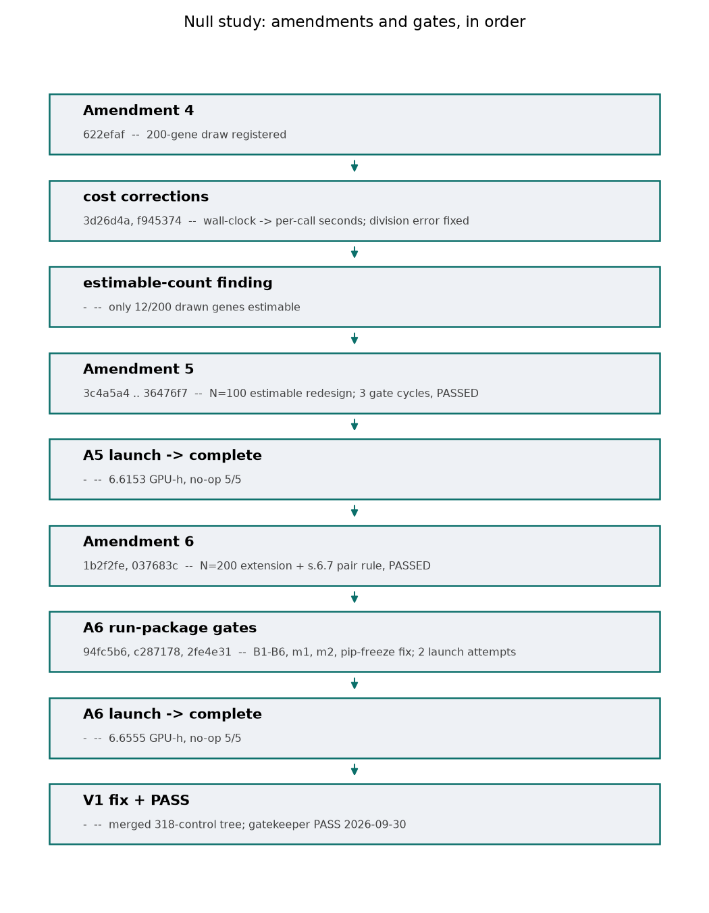

*Figure 12. The null study's amendments and gates, in the order they occurred, each box giving its
commit hash and a one-line summary. Source: `scripts/make_null_study_figures.py`, committed alongside
this report; process history only, drawn from the commits cited throughout this section.*

### 2.6 Reproducibility and provenance discipline

Every amendment to the registration document is append-only, verified both by `git diff --numstat`
showing zero deletions to the registration file and by a byte-prefix sha256 check, in which the first N
bytes of the amended file must hash identically to the entire pre-amendment file, before any push. Every
script, weight file, token dictionary, and data artifact that a GPU run consumes is sha256-pinned in
that run's launch script and re-verified immediately before any GPU time is spent, and a mismatch
refuses the launch outright. A single-host claim lock on each run's output tree prevents two runs from
overlapping. Ceiling enforcement reads each call's own recorded `seconds` field against the real
process group, verified with `ps -o pid,pgid,cmd` rather than `pgrep -f`, which has repeatedly matched
a launcher's own shell process in earlier stages of this and related studies, and never from wall
clock. Before Amendment 6's markers were treated as poolable with Amendment 5's, a bridge check
re-ran three already-completed gene-donor pairs fresh into a scratch directory and required the raw
output to be bitwise identical to the original for both operations before any new gene was run; all
six checks passed. Before any analysis script reads Amendment 5's output tree, it re-verifies a full
sha256 manifest of that tree recorded at the gatekeeper's post-run clearance, and the manifest file's
own hash is itself pinned inside the analysis code, so the manifest cannot be silently swapped for one
that always passes.

---

## Provenance table

This table covers design, process, and result facts. Every result number in Sections 3 and 4 traces to
one of the rows below, each citing the file and commit or run artifact it comes from rather than this
prose.

| # | Claim | File | Commit or artifact |
|---|---|---|---|
| P1 | Raw donor cell-count imbalance of 28 to 31-fold before capping, 1.0 after | `provenance/PHASE0_SELECTION_RULE.md` | `3af3ca98` |
| P2 | LuCA extended atlas download verified, sha256 `f0f7f434...` | download manifest, data root | Phase 2 close-out, 2026-09-24 09:06Z |
| P3 | 43-donor cohort, 8,600 analysis and 25,700 pool cells, seed 20260924 | `provenance/PHASE0_SELECTION_RULE.md`; cohort and tokenization artifacts | `3af3ca98` |
| P4 | Model is 316M bf16 with no 104M arm, by directive | `registration/PHASE5_ISP_REGISTRATION.md`, Amendments 1 and 2 | `e2e10421`, `f5805cbc` |
| P5 | Calibrated throughput: 8.19 cells/s fine-tuning, about 20 s/gene ISP | Amendment 1 | `e2e10421` |
| P6 | Five-fold donor-stratified cross-fit design | `scripts/make_split.py`; Amendment 1 | `e2e10421` |
| P7 | Host split by gene; cross-host tolerance max\|Δ\|≤1e-3, ρ≥0.999 | Amendment 3 | `a5fe96a7` |
| P8 | Panel A (15 genes) and Panel B (36 genes) | registration section 1b | `552f0dfa` |
| P9 | Matched-control strata, six of 20 genes, later 19 strata / 318 unique | Amendment 3c | `6ebf7fb1` |
| P10 | Phase 7 launch refusal (overexpression cell-order ambiguity) and its fix | Amendments 3e, 3f, 3g, 3h | `b9aafc6`, `10d0099`, `0f572cb`, `b2473ef` |
| P11 | Phase 6 duplicate-grid finding: both hosts ran a near-full independent copy | output marker `host` field, both hosts' `phase6/` trees | verified read-only, 2026-09-29 |
| P12 | Null gene frame of 19,902 genes and draw mechanism, seed 20260929 | `scripts/select_null_genes.py`, `phase8_null/null_genes_*.json` | `622efaf` |
| P13 | Cost-model coefficients and out-of-sample/extrapolation checks | Amendment 5, section 5.11 | `e4c3a4e` |
| P14 | Amendment 5 N=100-estimable design; hundredth estimable gene at draw position 984 | Amendment 5 | `3c4a5a4` |
| P15 | Amendment 6 N=200 extension and the section 6.7 pair-decision rule | Amendment 6, section 6.7 | `1b2f2fe`, `037683c` |
| P16 | `apply_noop_gate` real-format parsing fix and its deviation note | registration deviation note; `scripts/null_analysis.py` | `c287178` |
| P17 | Power-by-simulation table, N=100 and N=200 | Amendment 6, section 6.4 | `1b2f2fe` |
| P18 | ISP-STD-1 v1.1 adoption | `hive/standards/isp-outcome-criteria.md` | adopted 2026-09-28, 13:35 JST |
| P19 | Classifier gate: pooled BA 0.825, per-fold 0.784-0.869, sign test p=2.3e-13, 13 pre-analysis gates satisfied | `balanced_donor_luad/RESULTS.md` section 1; `phase4_results/classifier_gate.json` | published, `main` (origin/main `40306bf` at time of writing) |
| P20 | Panel A outcome: 13 NOT_RUN, 1 NOT_ESTIMABLE_CONTROLS (BTG1), 1 OPEN (POLR2J3, p=0.10/0.25) | `RESULTS.md` section 2; `phase7_results/outcome_rows.json` | published, `main` |
| P21 | Panel B outcome: 11 TOWARD, 2 AWAY, 2 DELETION_ONLY, 19 OPEN, 5 NOT_RUN; stability under 4 registered sensitivities | `RESULTS.md` section 3, 5; `phase7_results/outcome_rows.json`, `sensitivities.json` | published, `main` |
| P22 | Matched-control null cloud: rho=-0.62 over 360 control x stratum entries; 4 genes (CCR7/CD3D/GZMA/CD7) outside the control spread | `RESULTS.md` section 4 | published, `main` |
| P23 | Null study A5 N=100 primary: positive, rho=-0.593, p at the 100,000-permutation floor, LOO 100/100, bootstrap 1.0 (10,000) | `phase8_null/a5_primary_result_v2.json`, sha256 `a00ccb2f62a7a888386208eb63a2f349d1c2ee8717208f742a563bc508588267` | `2fe4e31`, gatekeeper PASS 2026-09-30 11:06Z |
| P24 | Null study N=200 confirmatory extension: positive, rho=-0.608, p at the permutation floor, LOO 200/200, bootstrap 1.0, no-op 10/10; s.6.7 headline "positive, confirmed at N=200" | `phase8_null/n200_combined_result_v2.json`, sha256 `c9e56026fac99d30a89da91ab557b09e7889717163712242a961d33295a3b847` | `2fe4e31`, gatekeeper PASS 2026-09-30 11:06Z |
| P25 | R3 validity check on 318 registered controls (308 estimable): rho=-0.658, sign-compatible with -0.62, not failed | same files as P23/P24; merged controls tree `phase6_all_merged` on thinkstation1, manifest sha256 `5da69fedc48fa382cbdfe2e6173cc38dc87b3f4b39535869606369a4db1797c1` | `2fe4e31`, gatekeeper PASS 2026-09-30 11:06Z |
| P26 | Figures 1-8 unchanged since original generation, verified by sha256 against the copy on `main` | `figures/fig1_design.png` through `fig8_outcome_table.png` | `a6bf6d0`, no commit since has touched `figures/` on `main` |
| P27 | Figures 9-12 (null study), generated only from the two files in P23/P24, hash-checked before plotting; figure 10 is a labeled illustrative reference, not a reconstruction of the actual permutation draws | `scripts/make_null_study_figures.py` | committed alongside this report |

---

## 3. Results

### 3.1 Classifier gate (Phase 4)

The pooled, held-out balanced accuracy across the five donor-stratified folds was 0.825, comfortably
above the pre-registered 0.60 threshold, and ranged from 0.784 to 0.869 across individual folds. Every
one of the 43 donors scored above chance, and the exact sign test across donors gave p = 2.3 x 10^-13.
A repeat run of the same fold under the same seed showed a per-donor nondeterminism band of about 0.045
in balanced accuracy; even the least favorable donor could not be flipped by a band of that size, and
the pooled value sits far outside the band around the 0.60 threshold.

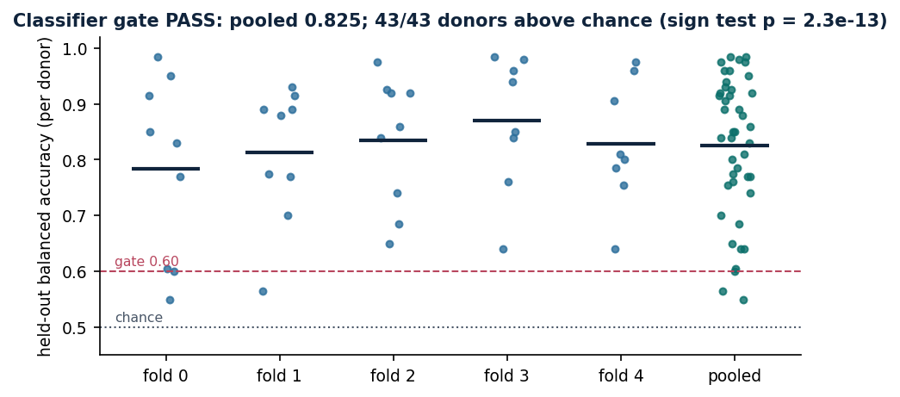

*Figure 2. Per-donor held-out balanced accuracy, one point per fold plus the pooled value, against the
0.60 gate threshold. Source: `balanced_donor_luad/scripts/make_figures.py`, committed `a6bf6d0` on
`main`.*

The gate passed, and every
pre-analysis gate registered in `registration/required_gates.json` (ambient classification, the no-op
gate, cross-host equivalence for both operations, token-edit verification, and eight others) was
satisfied before Phase 7 began (`balanced_donor_luad/RESULTS.md`, section 1; `phase4_results/`,
committed on `analysis/balanced-donor-luad`).

### 3.2 Panel A: the July screen's genes are mostly untestable in T cells

Thirteen of the 15 genes carried over from the July screen could not be tested at all: each was
expressed in fewer than the required 10 of 100 tumor T cells in almost every donor. Inspecting the
list, these 13 genes are keratins, a mucin, a secretoglobin, a hemoglobin chain, and other epithelial
or blood-lineage markers, not T-cell genes. One gene, BTG1, could not be scored because its matched
control stratum had fewer than the required 20 candidate controls. The single gene that could be
tested, POLR2J3, showed no reliable shift in either direction (delete median -0.0009, p = 0.10;
overexpress median -0.0006, p = 0.25; Holm-adjusted p = 1 for both, out of a family of 15). None of
this amounts to a failed replication in the ordinary sense. It shows that the July screen's list, built
from a different, less controlled design, was describing biology outside the T-cell compartment for
all but one gene, and that one gene gave an open call rather than a contradiction.

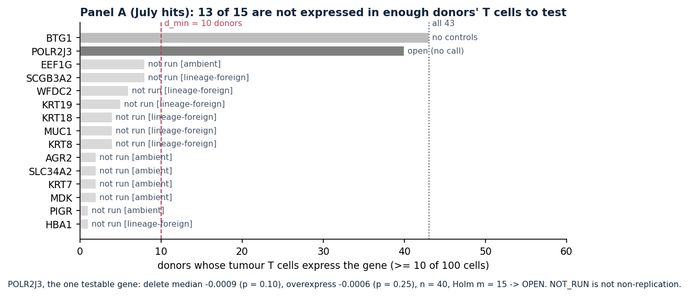

*Figure 3. Why 13 of the 15 Panel A genes could not be tested: estimable donor counts against the
design minimum of 10. Source: `balanced_donor_luad/scripts/make_figures.py`, committed `a6bf6d0` on
`main`.*

### 3.3 Panel B: a stable signal in 13 of 34 testable genes

Eleven genes moved tumor T cells toward the matched donor's own normal-tissue profile when deleted and
away from it when overexpressed: CD3D, CD3G, CD247, CD7, LCK, LAT, CD8A, CCR7, GZMA, CD27, and ICOS.
Two genes, ITK and CTSW, showed the same coherence in the opposite direction. None of these 13 calls
changed under any of the registered robustness checks: substituting the global (rather than
donor-specific) goal centroid, using all cells rather than only token-positive cells for the
overexpression arm, splitting by study (Leader_Merad's 23 donors against the remaining 20), or
examining each cross-validation fold separately. Two further genes showed a real but incomplete
signal. GZMK moved consistently on deletion only, and reversed to the opposite-direction pattern under
the all-cells overexpression sensitivity. CD69 also moved on deletion only, and became inconsistent
under an alternative Holm-family convention and under the global-goal sensitivity. Both are reported as
open on the deletion-only or dose-incoherent status they actually earned, not folded into the stable
13.

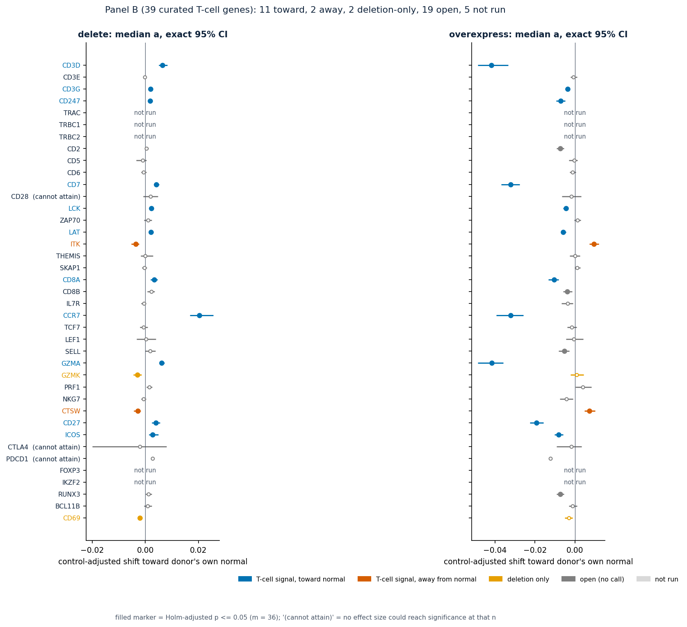

*Figure 6. Panel B forest plot: median control-adjusted shift with exact 95% confidence intervals for
deletion and overexpression, colored by status. Source: `balanced_donor_luad/scripts/make_figures.py`,
committed `a6bf6d0` on `main`.*

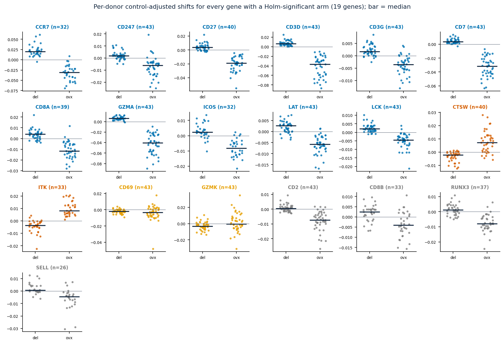

*Figure 5. Per-donor paired values for every gene with a significant arm, so donor-level spread is
visible rather than only the summary median. Source: `balanced_donor_luad/scripts/make_figures.py`,
committed `a6bf6d0` on `main`.*

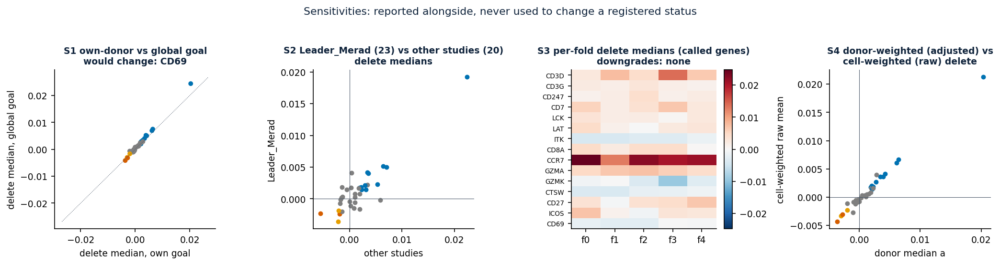

*Figure 7. The four registered sensitivity analyses (global goal, study split, per-fold, and
cell-versus-donor weighting), none of which downgraded a stable Panel B call. Source:
`balanced_donor_luad/scripts/make_figures.py`, committed `a6bf6d0` on `main`.*

Three genes commonly discussed in checkpoint biology, CD28, CTLA4, and PDCD1, were tested on 18, 14,
and 13 estimable donors respectively before the registered control-availability rule reduced this to 9,
6, and 5 donors, all below the design's minimum of 11. At that sample size none of the three can reach
significance at any effect size under the study's own multiple-comparison correction, so the result for
each is reported as open, with no evidence in either direction, rather than as a null finding. A fourth
gene, LEF1, sits just below the same design-level donor floor (10 versus 11) but was not flagged by a
secondary, post hoc check that asks whether significance was attainable given how the rest of the
gene family actually landed; the two criteria disagree only on this one gene, and both readings are
reported rather than one being discarded.

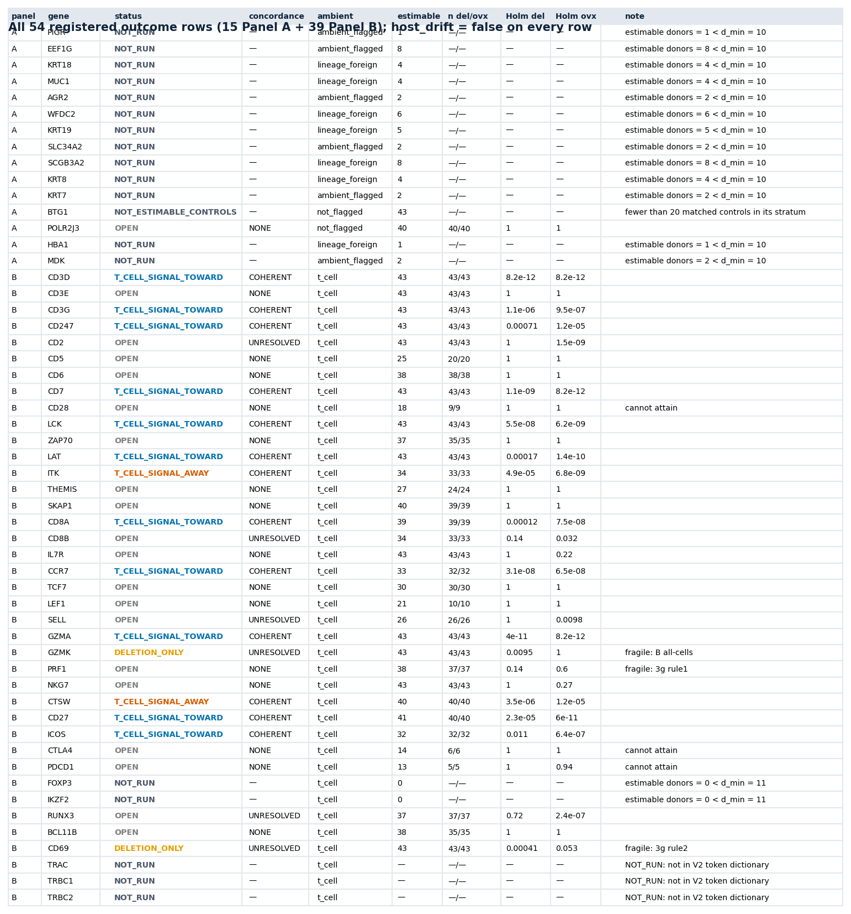

*Figure 8. All 54 registered rows (Panel A and Panel B) with status, concordance, ambient label,
estimable donor count, and Holm-adjusted p per arm. Source:
`balanced_donor_luad/scripts/make_figures.py`, committed `a6bf6d0` on `main`.*

### 3.4 The matched-control genes already hinted at a generic pattern

Across the 360 control-gene-by-stratum entries used to adjust the panel results, the donor-median
deletion and overexpression shifts were themselves anti-correlated (Spearman rho = -0.62), and about
35% of control entries fell in the same toward-normal quadrant as the panel's positive calls. Measured
against this control spread, only four of the 13 stable Panel B genes, CCR7, CD3D, GZMA, and CD7, stood
out as unusually large in effect size; the rest sat within the range the controls themselves produced.
This observation was descriptive and post hoc at the time it was made, and the study's own registration
was explicit that it narrows what a concordance finding licenses without overturning it. The null study
described next was designed to test the same question directly, on genes drawn independently of any
panel or control assignment, under a pre-registered statistical test rather than a post hoc comparison.

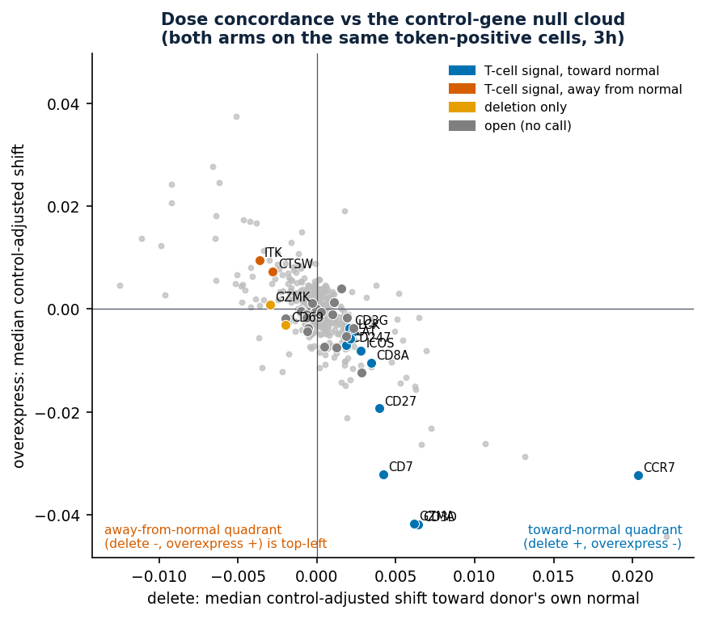

*Figure 4. Median deletion shift against median overexpression shift, one point per gene; the panel
genes are shown against the grey cloud of matched control genes, which shows the same anti-correlated
shape. Source: `balanced_donor_luad/scripts/make_figures.py`, committed `a6bf6d0` on `main`.*

### 3.5 Null study: a directional artifact confirmed on random eligible genes

The registered primary result, over the 100 estimable genes drawn independently of Panel A, Panel B,
and every gene ever used as a matched control (random eligible genes detectable in LUAD tumor T cells,
never all genes in the model's vocabulary), was positive under ISP-STD-1's vocabulary: the one-sided
permutation test on the correlation between raw donor-level median deletion and overexpression shifts
gave Spearman rho = -0.593, with p at the permutation floor of the 100,000-permutation test (no
permuted draw reached or exceeded the observed correlation). Every one of the 100 leave-one-out
recomputations remained stable, and all 10,000 bootstrap draws preserved the result. The pre-registered
extension to 200 genes, nested inside the same draw and read under the study's own decision rule as
confirming the primary result rather than replicating it independently, gave the same picture: rho =
-0.608, again at the permutation floor, with all 200 leave-one-out recomputations and all 10,000
bootstrap draws stable. All ten of the due no-op spot checks across both runs passed. Under the
registered decision rule, the finding is reported as positive, confirmed at N=200.

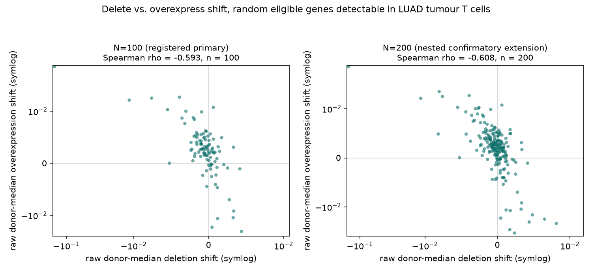

*Figure 9. Raw donor-median deletion versus overexpression shift, one point per gene, for the N=100
primary and the N=200 confirmatory extension (random eligible genes detectable in LUAD tumor T cells).
Axes are symmetric-log scaled; one gene's shift is roughly an order of magnitude larger than the rest
and would otherwise compress the remaining points. Source:
`balanced_donor_luad/scripts/make_null_study_figures.py`, reading only the two files the gatekeeper
signed (sha256 `a00ccb2f...` and `c9e56026...`).*

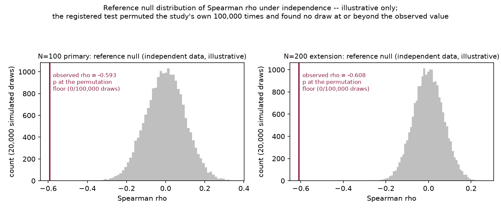

*Figure 10. A reference distribution of Spearman rho under independence at the same sample sizes,
shown for illustration only: the signed output files record the observed correlation and that its
one-sided p sits at the permutation floor of the registered 100,000-permutation test, not the individual
permuted values, so the histogram here is a fresh simulation of independent data at matching n, not a
reconstruction of the actual test. Source: `scripts/make_null_study_figures.py`.*

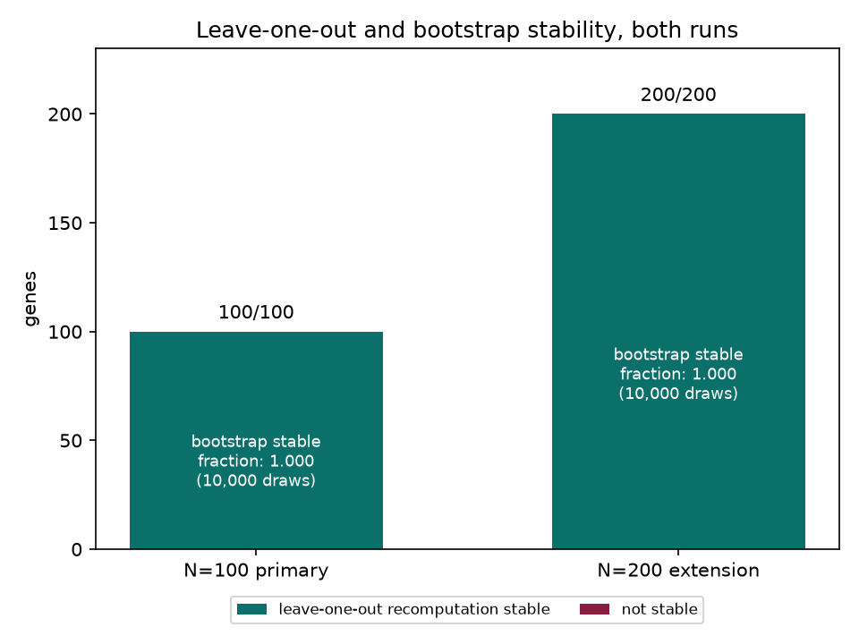

*Figure 11. Leave-one-out and bootstrap stability for both runs: every held-out recomputation and every
bootstrap draw preserved the result. Source: `scripts/make_null_study_figures.py`.*

A validity check reran the identical pipeline on the study's own 318 matched control genes, of which
308 were estimable in this cohort, and recovered a correlation of rho = -0.658, matching the sign of
the -0.62 figure already reported from the panel analysis. Because the two quantities are not the same
statistic (one is raw, one is stratum-adjusted, and they are computed over different gene sets and
donor weightings), only the sign is compared, and the sign matched.

Taken together, these three results, the original 120 to 318 matched controls, the 100-gene primary
draw, and its 200-gene confirmation, converge on the same conclusion: an anti-correlation between a
gene's deletion effect and its overexpression effect is common across genes with no particular relation
to the tumor-versus-normal axis in this model and this experimental design. It is not restricted to the
genes chosen for the panels.

---

## 4. Discussion

The clearest result in this study is negative in the ordinary sense but informative in what it rules
out. Thirteen of the 15 genes inherited from the July screen were simply not expressed in enough donors'
T cells to test, and inspection shows why: the list is dominated by epithelial and blood-lineage
markers. The donor-paired redesign did not contradict the earlier screen's findings so much as reveal
that the findings were never about T cells in the first place. This matters for how the July screen's
other output should be read going forward: a gene appearing on that list is weak evidence, by itself,
that the gene has anything to do with T-cell biology, and testability in a T-cell-restricted cohort is
itself informative.

The curated T-cell panel gave a more substantive result. Thirteen genes, most of them canonical
components of T-cell receptor signaling and effector function (CD3D, CD3G, CD247, LCK, LAT, CD8A, GZMA,
CD27, ICOS) or migration and memory (CCR7), showed a stable, direction-consistent response to deletion
and overexpression that survived every sensitivity analysis the study registered in advance. Two genes,
ITK and CTSW, showed the same internal coherence in the reverse direction. This is a real, reproducible
pattern in the model's behavior on this cohort.

The null study changes how that pattern should be interpreted, without erasing it. A sample of 100, and
then 200, genes drawn with no relationship to the tumor-versus-normal axis, and excluded from every
panel and control assignment in the study, showed the same negative correlation between deletion and
overexpression effects, at a magnitude (rho around -0.59 to -0.61) that sits alongside the panel's own
matched-control cloud (rho -0.62) rather than below it. Whatever produces opposite-signed responses to
deletion and overexpression in this model, whether it reflects a property of how Geneformer represents
dose, a property of the donor-centroid goal construction, or something about this specific tissue
comparison, it operates on genes with no connection to T-cell biology about as strongly as it operates
on the 13 genes the panel called. Registered concordance between deletion and overexpression, on its
own, is therefore not evidence that a gene is doing something T-cell-specific. It is evidence that the
gene passed a test that most eligible genes in this cohort would also pass.

This does not mean the 13-gene panel result is void. Four of the 13 genes, CCR7, CD3D, GZMA, and CD7,
showed effect sizes clearly outside the spread of the study's own matched controls, and the null study
did not test effect size, only direction. A gene's concordance direction is common; an unusually large
concordance, measured against a population of genes with no prior claim to relevance, is a different
and more specific kind of evidence. The panel's headline calls should be read with this distinction in
mind: consistency across donors and both perturbation directions establishes that the model is doing
something reproducible with each of these 13 genes, and the four with unusual effect sizes are the
better candidates for that something being specific to T-cell state, while the direction-only criterion
by itself is now shown to be a weak discriminator.

Three limitations bear directly on this conclusion. First, the null study's gene population is bounded
by what is detectable in this specific cohort of tumor T cells rather than being an unconditioned
sample of the transcriptome, so the finding generalizes to eligible genes in this tissue and cell type,
not beyond it. Second, the null study and the panel share the same pipeline, the same donor-centroid
goal construction, and the same model, so this result cannot distinguish a genuine biological tendency
of gene dosage from an artifact specific to this combination of model and design; a comparison against
an independently constructed null, or against a different goal definition, would be needed to separate
those possibilities, and is not attempted here. Third, an earlier, differently constructed whole-model
screen (104M, fp32, class-centroid goal, cell-weighted) showed the same directional pattern at a weaker
magnitude (Spearman rho -0.08 to -0.30 across six comparisons), which corroborates that the phenomenon
is not unique to this study's specific instrument, but that screen used a different model, precision,
goal definition, and weighting scheme, so it is corroborating evidence rather than a pooled estimate
and cannot itself rank the 13 panel genes.

The broader point, stated plainly rather than as a caveat appended at the end, is that a pre-registered
null study of this kind is worth the GPU time it costs whenever a design's own matched-control data
hints at a systematic pattern, because a post hoc observation on 120 to 318 already-computed genes and
a dedicated, adequately powered test on independently drawn genes can and did agree here, which is
itself worth knowing, but they are not interchangeable evidence, and only the dedicated test was
powered in advance to say how strong that agreement is.

---

## 5. Limitations

Several limitations are inherent to the design, independent of what the results turned out to show.
Ambient RNA contamination differs between tumor and adjacent-normal tissue within the same donor in
ways that pairing cannot remove, since pairing controls for study, chemistry, and donor identity but
not for tissue-of-origin contamination; the study's per-gene ambient flag, computed by
leave-one-anchor-out, exists specifically to disclose this rather than let it disappear into a
clean-looking headline, though in this study no Panel A gene reached a call for the flag to qualify.
The 316M model differs from the 104M model used in
the July screen (a prior comparison measured a correlation of 0.489 between the two), and because no
104M arm was run here by directive, any non-replication on Panel A cannot be attributed cleanly to the
redesigned cohort as opposed to the change in model; this caveat was written into the registration
before any output existed, not added after the fact. Twenty of the 43 donors in this study overlap the
donor pool the July screen's LUAD class drew from, so the two studies are not independent at the level
of the underlying population. The cohort is structurally biased toward donors with more T-cell
infiltration, since donors need at least 100 T cells in both tissues to qualify. LUSC tissue was
excluded because only nine donors qualify on 10x chemistry within LuCA, short of the registered floor
of twelve; a wider public-data survey for a third class was scoped but not pursued once the human
settled on the two-class design. The null study's Amendment 6 extension is nested inside Amendment 5's
primary gene set rather than independent of it, and the registered section 6.7 rule treats it strictly
as a confirmatory extension of the same draw: a positive extension result can never upgrade a
non-positive primary headline. And the Phase 6 GPU-hour accounting reflects two near-complete
overlapping runs on the two hosts rather than a clean complementary split, a fact discovered from the
output markers' own host field rather than from the runner's docstring; this changes what the original
combined GPU-hour figure actually describes, though it does not change any result that the cross-host
equivalence check had already verified.

---

## 6. References

- ISP-STD-1 v1.1, `hive/standards/isp-outcome-criteria.md`, adopted 2026-09-28.
- `balanced_donor_luad/registration/PHASE5_ISP_REGISTRATION.md`, all amendments, this repository,
  branch `analysis/balanced-donor-null-20260929`, current sha256 `465149ff...`.
- `balanced_donor_luad/provenance/PHASE0_SELECTION_RULE.md`.
- `balanced_donor_luad/RESULTS.md`, the Phase 4 through 7 results this report restates and builds on,
  including its own GPU-hour accounting (section 9, total approximately 33.8 GPU-hours against a
  registered estimate of approximately 31) and the Phase 6 duplicate-grid finding as recorded there.
- PR #38, `Kays3/geneformer-lung-tcell`, Phases 4 through 7, merged to `main` as `87349d41`.
- Salcher et al., *Cancer Cell* 2022, the Lung Cancer Atlas, extended atlas.
- Geneformer V2, vendored checkout, commit pinned in the run-launch hash-check dictionary.
