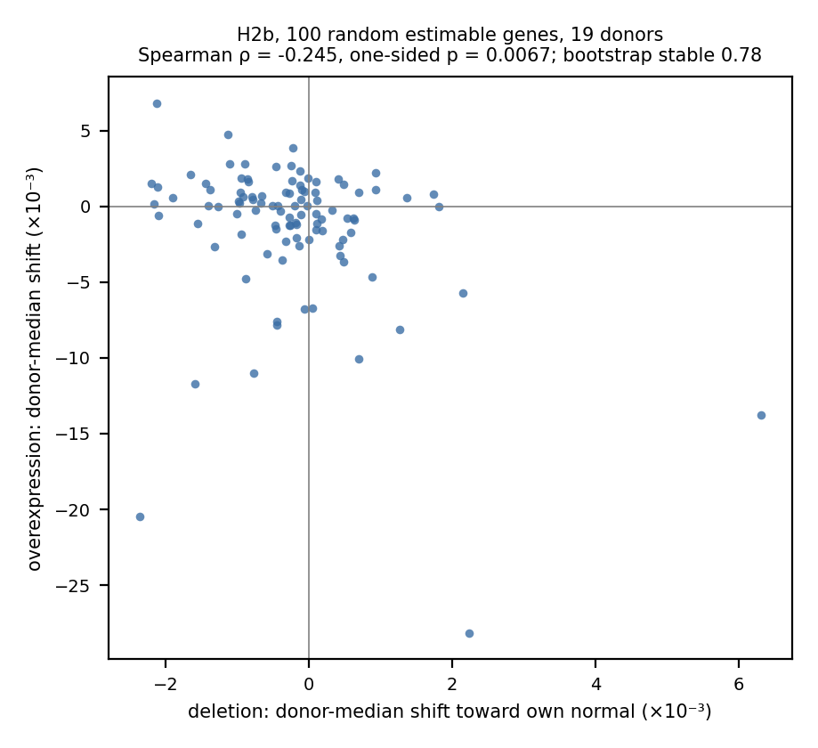
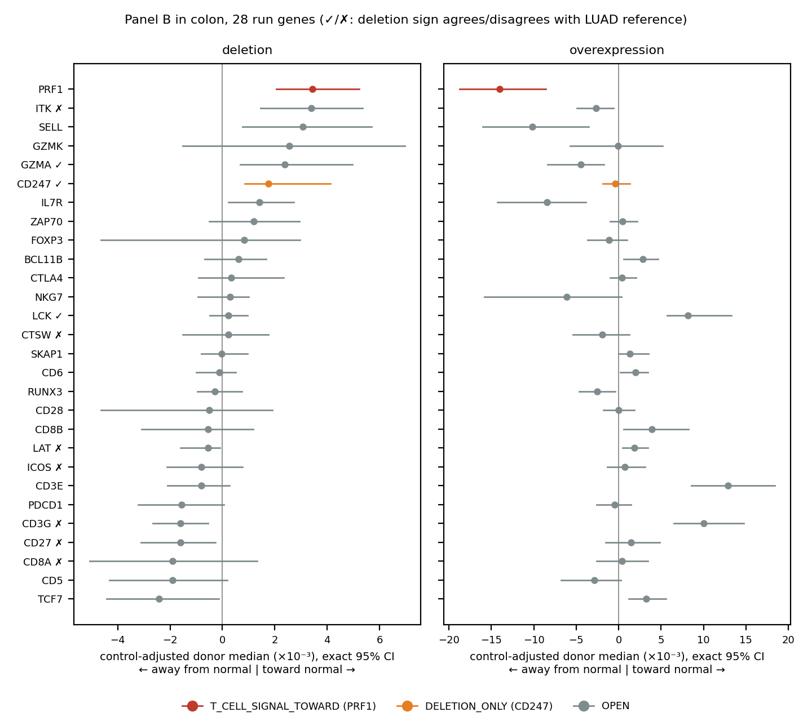
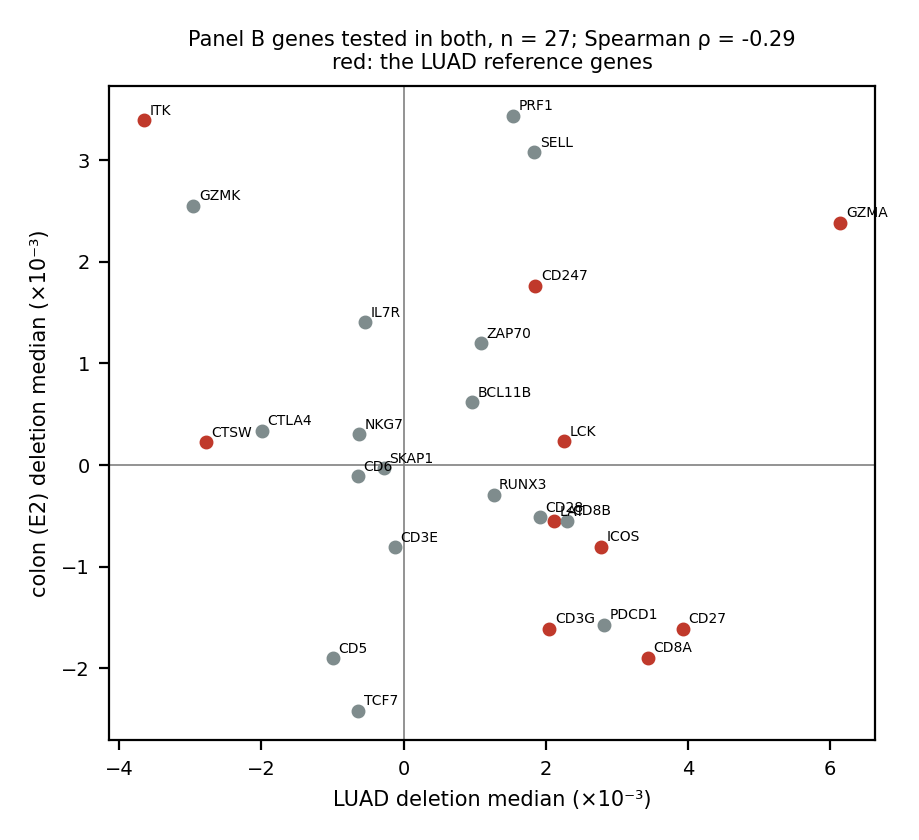

# E2: the balanced-donor Geneformer perturbation design on colorectal cancer T cells

**Author:** Kaisar Dauyey, Laboratory of Mathematical Biology, Hokkaido University, Japan  
**Study:** E2, the balanced-donor Geneformer design re-run on Pelka et al. 2021 colorectal cancer (GEO GSE178341), 19 donors, unsorted CD4 and CD8 T cells, tumour against the same donor's normal colon.  
**Status:** complete. H2a PASS (reported in the interim report of 1 October); H2b `control_draw_sensitive_open`; H2c `pattern_not_replicated`.  
**Date:** 2 October 2026 (JST). ISP 30 September 17:42 UTC (1 October 02:42 JST) to 2 October 01:20 UTC (10:20 JST); analysis 2 October 02:27 to 03:21 UTC (11:27 to 12:21 JST), all on thinkstation1.  
**Sources:** branch `analysis/e2-pelka-crc-20261001` of Kays3/geneformer-lung-tcell at `55b06a4` (results `b7369cb`): `pelka_crc_e2/registration/E2_REGISTRATION.md` (gate-passed by Stanley at `8b11d5d`; deviation log s.12, entry D1), `pelka_crc_e2/phase4_results/classifier_gate.json`, and `pelka_crc_e2/results/` (`h2b_null_result.json`, `h2c_result.json`, `panel_b/outcome_rows.json`, `panel_b/sensitivities.json`, `isp_compute.txt`, `analysis_driver_log.txt`). LUAD comparison: `balanced_donor_luad/phase7_results/outcome_rows.json` (sha256 `083b1ef0…`) and the balanced-donor IMRaD report of 30 September. Interim report: `hive/reports/md/geneformer-e2-classifier-gate-20261001.md`.

## Summary

The balanced-donor LUAD study gave three results. A fine-tuned Geneformer classifier separated tumour from adjacent-normal T cells of the same donor (R1). Deletion and overexpression shifts toward the normal state were negatively rank-correlated across random genes (R3; rho −0.593). Thirteen curated T-cell genes reached a stable, dose-concordant status (R2). E2 repeated the design, unchanged, on colorectal tumour and normal-colon T cells of 19 donors, to ask whether these results belong to the model and design or to lung.

The classifier transferred: pooled held-out balanced accuracy was 0.904, with all 19 donors above chance (H2a PASS). The deletion/overexpression anti-correlation appeared in the same direction but weaker. Over 100 random estimable genes, Spearman rho was −0.245 (one-sided permutation p = 0.0067, 100,000 permutations). All 100 leave-one-out tests also passed, but only 78% of gene bootstraps stayed significant, against a registered stability bar of 95%. The registered reading is therefore `control_draw_sensitive_open`: the direction matches lung, but the result is not stable. The LUAD Panel B pattern did not replicate. Of the 10 LUAD reference genes testable in colon, 3 kept their LUAD deletion sign (one-sided binomial p = 0.95; the registered bar was 9 of 10). In colon, 1 of 28 run Panel B genes reached a dose-concordant status (PRF1, toward normal), and it was not one of the LUAD reference genes. Across the 27 Panel B genes tested in both tissues, deletion medians correlated weakly and negatively between lung and colon (rho −0.29; descriptive, compatible with zero).

A different result in colon cannot be attributed to tissue alone. Study, dissociation, chemistry, annotation, the null-gene population and the fold models all differ, and 19 donors give less power per gene than 43.

## Introduction

In-silico perturbation (ISP) with a fine-tuned single-cell foundation model ranks genes by how far deleting or overexpressing them moves a cell's embedding toward a goal state. The balanced-donor LUAD study used Geneformer-V2-316M to move tumour-infiltrating T cells toward the same donor's adjacent-normal T cells. It was designed to remove the confounds of earlier screens: study-confounded normal classes, unbalanced donors and cell-weighted statistics. Its main finding was a caution, not a gene list. Across random genes, deletion and overexpression shifts were anti-correlated (R3), so a gene with opposed effects in the two arms is the baseline expectation, not evidence of specific regulation. Thirteen of 34 testable curated T-cell genes still reached a stable, dose-concordant status against matched controls (R2).

Whether those results reflect Geneformer and the design, or the lung data, cannot be decided inside one dataset. E2 re-runs the same pipeline on colorectal cancer (Pelka et al. 2021), the only public cohort with enough donors carrying both tumour and normal-tissue T cells on 10x chemistry (E0 feasibility). Three hypotheses were registered before any GPU step: H2a (R1 transfers), H2b (R3 transfers; primary) and H2c (the R2 pattern holds).

## Methods

**Cohort (registration s.2).** CD4 and CD8 T cells (author annotation `clMidwayPr` TCD4 or TCD8) from unsorted samples of primary tumour and normal colon. Every donor with at least 100 such cells in both tissues was kept: 19 donors, 9 MMR-deficient and 10 MMR-proficient. A fixed-seed draw, identical to the LUAD study, gave exactly 100 analysis cells per donor per tissue (3,800 cells) and up to 300 training-pool cells (9,039 cells). Chemistry (10x 3′ v2 or v3) never differs between a donor's two tissues. Cells were tokenised for Geneformer V2 (median 769 tokens per cell; LUAD 755).

**Model and folds (s.5.1, s.5.4).** Five-fold donor cross-fitting (seed 20260924) held out 4, 4, 4, 4 and 3 donors, with both tissues of a donor in the same partition and 2 eval donors per fold (LUAD used 4). Each fold fine-tuned a new classifier from the base Geneformer-V2-316M weights with the LUAD recipe unchanged: 1 epoch, learning rate 5e-5, batch 8, 6 frozen layers, seed 43, bf16. The LUAD fold models were not reused.

**Perturbation (s.5.4).** For each gene, both deletion and overexpression were applied to each donor's 100 tumour analysis cells. Each donor used its own fold model and its own goal, the mean CLS embedding of that donor's normal-colon pool cells. The shift is the change in cosine similarity to that goal. Order: 100 null genes, then 28 eligible Panel B genes, then 241 matched control genes; 369 genes × 19 donors × 2 operations = 14,022 calls. A no-op gate (no edit, shift exactly 0) passed before the screen, and 18 no-op spot checks during it (every 20th gene, two independent runs) all gave a difference of exactly 0.

**Gene sets (s.5.2, s.5.3).** Panel B is the LUAD file unchanged (39 genes; TRAC, TRBC1 and TRBC2 cannot be perturbed). A gene is eligible if its token appears in at least 10 of a donor's 100 tumour cells in at least 11 donors. CCR7, THEMIS, IKZF2 and LEF1 failed this and are NOT_RUN. Matched controls (20 per stratum; detection within 0.5 log2, rank percentile within 5 points) could not be found for CD2, CD3D, CD7 and CD69, the most highly detected genes; these four are NOT_ESTIMABLE_CONTROLS. That left 28 panel genes in 14 strata. Null genes: a fresh seeded draw (seed 20261001) from the token dictionary, excluding Panel B and controls, frozen at the first 100 genes estimable in at least 10 of 19 donors.

**H2b analysis (s.6.2; `null_analysis.py` unchanged).** Per null gene and operation, the donor-level mean shift over token-positive cells, then the median over estimable donors (at least 10 donors). No control adjustment. Test: Spearman rho between the 100 deletion and 100 overexpression medians, one-sided permutation test (H1: rho < 0), 100,000 permutations. `positive` requires p ≤ 0.05, every leave-one-gene-out p ≤ 0.05, and a stable fraction ≥ 0.95 in a 10,000-draw gene bootstrap. If the first two hold but the bootstrap does not, the status is `control_draw_sensitive_open`. A validity check reruns the same pipeline on the control genes and passes if rho < 0.

**H2c analysis (s.6.3).** Per-gene statuses come from `analyse.py` with the LUAD rules unchanged: control-adjusted donor values, exact two-sided Wilcoxon, Holm over the 36-gene family, and dose concordance. The primary H2c reading counts how many of the 13 LUAD reference genes (T_CELL_SIGNAL_TOWARD or AWAY in LUAD), among those testable in colon, keep the sign of their LUAD deletion median. This uses an exact one-sided binomial test against 1/2. With 10 testable genes, `pattern_holds` needed at least 9 agreeing (P = 0.011).

**Deviations.** One logged entry (s.12, D1, 1 October 12:50 JST): per-gene ISP cost was about 2.5 times the registered prediction. The procedure, order, ceiling and analysis were unchanged. There were no other deviations. Two labels inside the unchanged LUAD script refer to LUAD numbers: the key name `validity_check_318_control_genes` and a docstring mention of 43 donors. So does the description string of the validity block in `h2b_null_result.json`, which mentions 318 controls, 19 strata and a LUAD rho of −0.62. The code reads the gene and donor sets from the E2 design file: 241 unique controls in 16 strata (14 with controls) and 19 donors.

## Results

**H2a: the classifier transfers (from the interim report).** Pooled held-out balanced accuracy was 0.904 against a bar of 0.60, with per-fold values 0.866 to 0.935. All 19 donors were above 0.5 (range 0.655 to 0.970), and the exact sign test gave p = 1/262,144. LUAD gave 0.825 with 43 of 43 donors above chance; the difference is not attributable to tissue alone (s.10). The classifier transferring means that tumour and normal-colon T cells of one donor are separable after fine-tuning on other donors. It does not test the LUAD models in colon.

**H2b: the anti-correlation is present but not stable.** All 100 null genes were estimable and none was stopped. Deletion and overexpression medians were negatively rank-correlated: rho = −0.245, one-sided p = 0.0067 (Figure 1). Every one of the 100 leave-one-gene-out tests stayed at p ≤ 0.05 with rho < 0. In 10,000 gene bootstraps, 77.9% stayed significant, below the 0.95 bar. The registered status is `control_draw_sensitive_open`: direction as in lung, not stable, reported as open. The validity check on the control genes, a more highly detected set, also recovered a negative correlation (rho −0.531; 231 of 241 controls estimable), so the pipeline detects the anti-correlation when it is present. The check is sign-only (s.6.2), and the two gene sets are different populations, so their magnitudes are not compared. For comparison, LUAD gave rho −0.593 on its first 100 null genes and −0.608 on 200.

*Figure 1. H2b. Each point is one of the 100 random estimable null genes: the median over donors of the per-donor mean shift toward the donor's own normal-colon centroid, for deletion (x) and overexpression (y). Spearman rho = −0.245, one-sided permutation p = 0.0067; 77.9% of gene bootstraps stable.*

The point cloud shows where the weaker correlation comes from. Most null genes have deletion and overexpression medians within a few thousandths of zero. The negative trend is carried mainly by a few genes with large overexpression shifts away from normal, some of which also have deletion shifts toward normal. The registered bootstrap is sensitive to exactly this kind of tail. We did not test why the colon null genes behave differently from the lung ones. The registration (s.10) named one candidate in advance: the unchanged estimable rule selects a more highly detected population with 19 donors (100th estimable gene at draw position 787, against 984 in LUAD).

**H2c: the LUAD Panel B pattern does not replicate.** Of the 13 LUAD reference genes, CCR7 was ineligible and CD3D and CD7 had no matched controls, leaving 10 testable. Three kept their LUAD deletion sign: GZMA, LCK and CD247 (Figure 2, ticks). The binomial test gave p = 121/128 = 0.95, so the reading is `pattern_not_replicated`. The seven that did not agree included CD3G, CD8A, CD27, ICOS and LAT, which were toward-normal in LUAD and had small negative deletion medians in colon, and ITK and CTSW, which were away in LUAD. On overexpression (descriptive), 2 of 10 kept the LUAD sign. Over the 27 Panel B genes with a deletion median in both tissues, LUAD and colon medians correlated at rho −0.29 (Figure 3).

*Figure 2. Panel B in colon: control-adjusted donor-median shift with exact 95% CI for the 28 run genes, deletion (left) and overexpression (right), coloured by registered status. ✓ and ✗ mark LUAD reference genes whose colon deletion sign agrees or disagrees with LUAD.*

Per-gene statuses in colon (registered rules, Holm over 36): 1 T_CELL_SIGNAL_TOWARD, 1 DELETION_ONLY, 26 OPEN, 4 NOT_ESTIMABLE_CONTROLS and 7 NOT_RUN (3 by construction, 4 ineligible).

- **PRF1, T_CELL_SIGNAL_TOWARD, COHERENT.** Deletion +0.0034 [0.0021, 0.0052], Holm p = 0.00027, toward normal in 18 of 18 donors. Overexpression −0.0140 [−0.0188, −0.0086], Holm p = 0.00025. PRF1 was OPEN in LUAD.
- **CD247, DELETION_ONLY.** Deletion +0.0018 [0.0009, 0.0041], Holm p = 0.0073, 17 of 19 donors toward normal. Overexpression −0.0004 [−0.0018, 0.0013], not significant. It was T_CELL_SIGNAL_TOWARD in LUAD, so its deletion direction agrees.
- **Significant overexpression without a deletion effect.** CD3E (+0.0129), CD3G (+0.0100) and LCK (+0.0082) moved toward normal on overexpression, each in 19 of 19 donors (Holm p = 0.00014), and IL7R moved away from normal (−0.0085, 16 of 19 donors; Holm p = 0.0085). Their deletion arms were not significant, so each stays OPEN under the registered dose-concordance rule. LCK is a LUAD reference gene; its colon overexpression points the opposite way to its LUAD overexpression (−0.0045), so it is not agreement.

The panel-level secondary sign test was balanced (14 toward, 14 away; p = 1.0). With S1, the fold-wide global normal goal in place of each donor's own, PRF1 stayed TOWARD and ITK and CD27 became DELETION_ONLY (3 DELETION_ONLY in total). Under the any-control alternative rule (Amendment 3g sensitivity), ITK became DELETION_ONLY. No registered status depends on these. The S3 fold downgrade did not apply to any gene, and no donor fell below the low-accuracy line used in the A3f checks. The LUAD study-split sensitivity (S2, Leader_Merad against the rest) does not apply to a single-study cohort.

*Figure 3. Deletion medians in LUAD (x) against colon (y) for the 27 Panel B genes tested in both. Red: the LUAD reference genes. Spearman rho = −0.29 (descriptive; compatible with zero). A difference between the two is not attributable to tissue alone (s.10).*

**Compute.** The ISP used 110,083 GPU-seconds (30.6 GPU-hours; the sum of the 14,022 markers' own timings) over 31.6 hours of wall time. With 7,180 s for fine-tunes, goals and gates, E2 used 32.6 GPU-hours, against the authorised 52. The registered prediction was 12.3 ISP hours. D1 records that miss, likely because the E2 genes are more highly detected, so each call perturbs more token-positive cells; this was not tested. The analysis ran on CPU in 54 minutes.

## Discussion

E2 gives a mixed answer to the question it was built for. The tumour/normal classifier transfers to colon with margin, so the model and recipe find a tumour-versus-normal T-cell axis outside lung. The deletion/overexpression anti-correlation, the main LUAD caution, appears in colon in the same direction and passes its primary test and every leave-one-out. It is weaker than in lung (rho −0.25 against −0.59) and fails the registered bootstrap bar, so it stays open. The control genes, a more highly detected set, also show a negative correlation. If the anti-correlation holds up, it would point to the model and design rather than lung; E2 does not settle this. The LUAD caution therefore still applies to colon: opposed deletion and overexpression shifts are not on their own evidence of a specific effect.

The gene-level result does not carry over. Only 3 of the 10 testable LUAD reference genes kept their deletion direction, fewer than half, and the one dose-concordant colon gene, PRF1, was OPEN in lung. Several explanations remain open, and these data cannot separate them:

- the LUAD statuses may reflect lung-specific T-cell biology, although a tissue attribution is not available from this comparison (s.10);
- they may reflect study-specific features of the LUAD data (dissociation, chemistry, annotation);
- with 19 donors, per-gene power in colon is lower, so genes that are OPEN here are not evidence against their LUAD status.

The deletion effects in colon are small, a few thousandths in cosine similarity, which is the same scale as in LUAD. With effects that small, modest differences between datasets could flip signs. Seven of the 10 point estimates had the opposite sign, which is within what chance gives (P = 0.17 for 7 or more of 10), and the rho of −0.29 over 27 genes is compatible with zero. These data do not separate low power from a real difference. Two genes are nominally opposite to LUAD before correction, CD3G (14 of 19 donors negative, raw p 0.0039) and ITK (11 of 13 positive, raw p 0.0024), and neither survives Holm (0.13 and 0.083).

Several limits apply.

- **Not a tissue comparison.** A different result in colon cannot be attributed to tissue: Pelka is one study with its own dissociation, 10x chemistry, T-cell annotation and sorting history.
- **New models.** E2 trains new fold models, so it does not test the LUAD models.
- **Power.** 19 donors from one study give less per-gene power than 43 donors from five studies.
- **Different null genes.** The E2 null genes are a more highly detected population than the LUAD ones.
- **Ambient RNA.** The within-donor ambient-RNA difference between tumour and normal tissue is not modelled for colon.
- **No causal claim.** Nothing here shows that any gene has a causal role in T-cell state. PRF1's status says only that, in this model and design, deleting it moves colon tumour T cells toward the normal-colon state and overexpressing it moves them away, consistently across donors.

For the lab talk: H2a passed; the anti-correlation appears in colon in the same direction but is weaker and not stable (open); and the LUAD Panel B pattern did not replicate. Gene-level ISP statuses from one tissue should not be carried to another without testing.

## References

- Pelka K, Hofree M, Chen JH, et al. Spatially organized multicellular immune hubs in human colorectal cancer. *Cell* 184:4734–4752 (2021). doi:10.1016/j.cell.2021.08.003. GEO GSE178341.
- Theodoris CV, Xiao L, Chopra A, et al. Transfer learning enables predictions in network biology. *Nature* 618:616–624 (2023). doi:10.1038/s41586-023-06139-9.
- Salcher S, Sturm G, Horvath L, et al. High-resolution single-cell atlas reveals diversity and plasticity of tissue-resident neutrophils in non-small cell lung cancer. *Cancer Cell* 40:1503–1520 (2022). doi:10.1016/j.ccell.2022.10.008.
- Kays3/geneformer-lung-tcell: `pelka_crc_e2/` (registration, results) and `balanced_donor_luad/` (LUAD design, rules and results).
