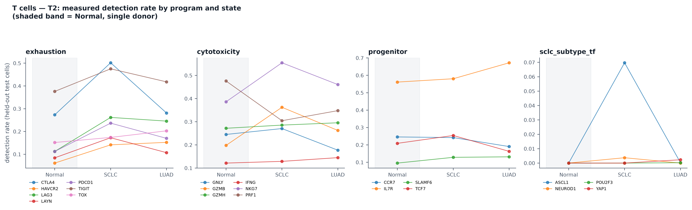
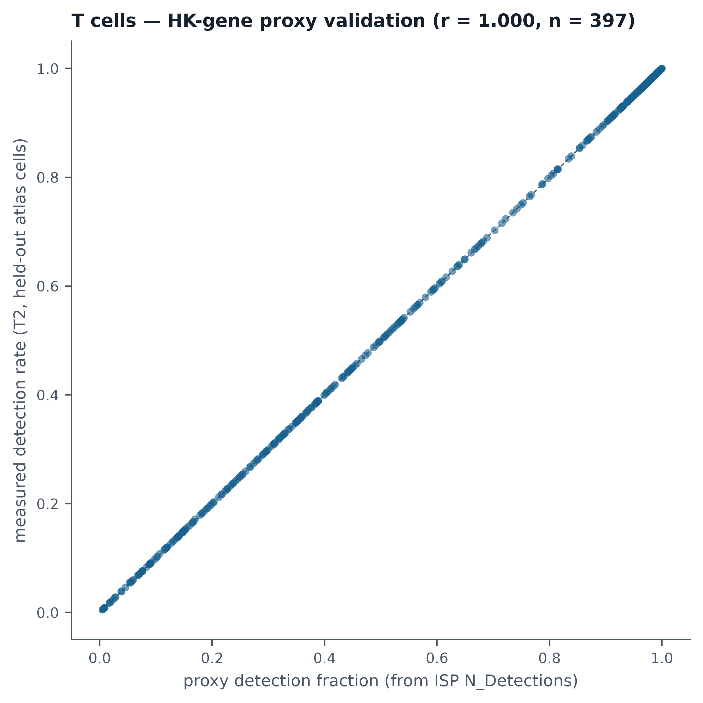

# Results — T2, measured baseline expression

**Status: run.** Test 1 (axis self-consistency) was already run and is documented in
[PLAN.md](PLAN.md); this is the second of the four follow-up tests it specified. Tests 3
(embedding geometry) and 4 (program-level overexpression) are now complete; see
[RESULTS_T3.md](RESULTS_T3.md) and [RESULTS_T4.md](RESULTS_T4.md). Per
[PLAN.md §10](PLAN.md#10-if-the-resolution-holds): **no poster or talk wording changes
here** — the combined evidence remains qualified and does not support an unconditional
replacement claim.

## What ran

[`measure_baseline_expression.py`](measure_baseline_expression.py), on `thinkstation2`
against the prepared H5AD (raw counts, `split`/`individual`/`celltype`/`disease` in
`obs`), restricted to the **9,377 held-out test cells** (6,387 LUAD / 2,424 SCLC / 566
Normal — the same held-out population the perturbation screens use). For each of the
21 pre-registered immune-axis genes plus the whole-genome HK-diagnostic's 155
concordant HK-flagged genes: per-donor detection rate and mean expression
(raw count and log1p CP10k), plus a state-level pooled rollup. Runtime: ~1 second once
the H5AD subset is in memory — the PLAN's "~2h" estimate was conservative.

Outputs: [`results/baseline_expression_pooled.csv`](results/baseline_expression_pooled.csv),
[`results/baseline_expression_per_donor.csv`](results/baseline_expression_per_donor.csv),
[`results/t2_program_summary.csv`](results/t2_program_summary.csv).
Analysis and figures: [`analyze_baseline_expression.py`](analyze_baseline_expression.py).

## The pre-registered falsification check

PLAN.md §8 stated in advance what would overturn the working resolution: *"T2 shows
SCLC T cells at equal or higher exhaustion expression than LUAD T cells. Then the
model's LUAD-ward direction is not tracking exhaustion level, the resolution in §5
fails, and the contradiction stands — in a sharper form."*

| | SCLC | LUAD | SCLC − LUAD |
|---|---:|---:|---:|
| Exhaustion program, mean detection rate | 0.092 | 0.123 | **−0.032** |
| Exhaustion program, mean log1p(CP10k) | 0.186 | 0.242 | **−0.055** |

**This criterion is not triggered.** SCLC sits measurably below LUAD on the exhaustion
program by both metrics. The model's LUAD-ward direction is, on this measure, moving
toward the state with genuinely more exhaustion-program transcript, not away from it.

## But the working resolution's specific claim is not confirmed either

[PLAN.md §5](PLAN.md#5-working-resolution-to-be-confirmed-by-tests-24) proposed **SCLC
≲ Normal < LUAD** — SCLC at or below Normal. Measured:

| | Normal | SCLC | LUAD |
|---|---:|---:|---:|
| Exhaustion program, mean detection rate | 0.081 | 0.092 | 0.123 |
| Exhaustion program, mean log1p(CP10k) | 0.180 | 0.186 | 0.242 |

SCLC sits **slightly above** Normal on both metrics, not at or below it. The measured
ordering is the simple monotonic **Normal < SCLC < LUAD** — the ordering the poster
originally asserted, reached here by direct measurement rather than by the two-shift
ISP argument T1 already showed is invalid. That is not the same thing as the original
argument being right: T1's finding stands on its own terms (the three states are not
collinear in the model's embedding, so reading a position from two ISP shifts was not a
valid inference). What T2 adds is that the *conclusion* those shifts pointed to happens,
independently, to have some support in measured expression — for the program average.
Whether that reflects the model tracking real biology or a coincidental alignment is
not something T2 can distinguish; T3 (projecting the actual ISP displacement into the
measured centroid geometry) is the test that could.

**The Normal comparison is a single donor** (566 cells, `PleuralEffusion` individual only)
throughout. A 0.011 detection-rate gap between Normal and SCLC is well within what one
donor's idiosyncrasy could produce. Read every Normal-vs-SCLC comparison here as
suggestive, not resolved.

## Per-gene detail: the program average hides real heterogeneity

| Gene | Normal | SCLC | LUAD |
|---|---:|---:|---:|
| CTLA4 | 0.051 | **0.118** | 0.145 |
| HAVCR2 | 0.042 | 0.083 | 0.050 |
| LAG3 | 0.152 | 0.089 | **0.186** |
| LAYN | 0.005 | 0.028 | 0.024 |
| PDCD1 | 0.060 | 0.061 | **0.153** |
| TIGIT | 0.193 | 0.181 | 0.207 |
| TOX | 0.062 | 0.083 | 0.099 |

Only 3 of 7 genes (`CTLA4`, `LAG3`, `TIGIT`) peak at SCLC rather than increasing
monotonically to LUAD; `PDCD1` is nearly flat between Normal and SCLC then jumps at
LUAD; `HAVCR2` is actually *highest* in SCLC of the three states. The program mean
supports Normal < SCLC < LUAD; individual checkpoint genes do not move together. This
matches T1's own finding that the seven exhaustion genes do not behave as one axis, and
is a reason to treat the program-average result above as directional, not as evidence
that "exhaustion" is a single coherent measured quantity here.

**Other programs, for context** (not the axis claim, but read alongside it):
cytotoxicity runs the other direction (Normal 0.350 > SCLC 0.347 > LUAD 0.227) and
progenitor increases toward LUAD (Normal 0.233 < SCLC 0.279 < LUAD 0.319) — composition
differences between the three cohorts (donor count, CD4/CD8 mix) are a live alternative
explanation for any of these and have not been ruled out here. `sclc_subtype_tf`
(ASCL1/NEUROD1/POU2F3/YAP1) is detected at ≤0.9% everywhere, consistent with these being
neuroendocrine/tumor-lineage transcription factors with no real business in a T cell;
the small nonzero SCLC value (0.9% vs 0% Normal, 0.06% LUAD) is a plausible ambient-tumor
signature rather than T-cell biology, given SCLC's neuroendocrine origin.

## Bonus: this also answers the HK-gene review report's own "next step"

The [HK-gene review response](../primary_test_perturbation/reports/hk_gene_review_response.html)
named T2 as the concrete next step for validating its detection-fraction proxy (delete-arm
`N_Detections` / total held-out cells, a stand-in for real measurement). Re-measuring
detection rate directly from the atlas for the same 155 HK-flagged concordant genes:

**Pearson r = 1.000, n = 397 gene-state pairs.** The proxy is not merely correlated with
ground truth, it is numerically the same quantity computed two different ways (delete-arm
`N_Detections` already *is* a detection count in the held-out cells; T2 recomputes it
directly from the source counts matrix). This validates the proxy's arithmetic — it does
not change the earlier report's interpretive finding that ~24% of HK-flagged concordant
hits (`B2M`, `EIF1`, `RPL27A`, …) show no detectable difference between states, since
that finding used the same underlying quantity. What T2 adds beyond the proxy is
`mean_log1p_cp10k` (real expression magnitude, not just presence/absence) for the same
genes, in [`results/baseline_expression_pooled.csv`](results/baseline_expression_pooled.csv),
confirming the earlier reads: `HSPA1A`, `HSPA1B`, `DNAJA1`, `DNAJB1` show large,
LUAD-specific expression increases (e.g. `DNAJB1` mean log1p CP10k 0.77 Normal / 0.56 SCLC
/ **2.31 LUAD**) — a real, substantial, state-linked signal, not an artifact.

## What this does not do

- This report does not replace the completed T3 and T4 analyses; see
  [RESULTS_T3.md](RESULTS_T3.md) and [RESULTS_T4.md](RESULTS_T4.md). Taken together,
  the axis claim remains **qualified**, not an unconditional replacement claim.
- Does not distinguish "the model tracks real exhaustion biology" from "the model's
  LUAD-ward direction correlates with exhaustion for reasons unrelated to exhaustion
  specifically" — both are consistent with a positive program-level correlation on 7
  genes with a single-donor Normal arm.
- Does not control for CD4/CD8 composition differences between the three cohorts, which
  is a live confounder for every program result above, exhaustion included.
