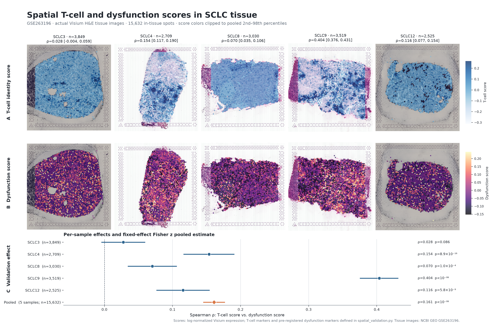

# GSE263196 spatial validation

Tests whether the audit's pre-registered T-cell dysfunction signature is
enriched in T-cell-rich regions of SCLC tumor tissue, using the GSE263196
Visium cohort identified as an orthogonal spatial validation source by
`sclc_validation/audit/`.

## Result

Across 5 SCLC Visium samples (15,632 in-tissue spots total), a per-spot
T-cell marker score is positively correlated with a per-spot dysfunction
(exhaustion marker) score in 4 of 5 samples individually (Spearman
p < 1e-3), and in the pooled 5-sample meta-analysis: **ρ = 0.161, 95% CI
[0.146, 0.176]**. See `figures/tcell_dysfunction_correlation_forest.png`
and `METHODS.md` for the full design and scope decisions.

## Tissue-level validation panel

[](figures/spatial_tissue_validation_panel.png)

The panel displays the official low-resolution Visium H&E image for each
sample, overlays every analyzed in-tissue spot using a shared score scale, and
shows the per-sample and pooled Spearman effect estimates. Generate it with
`plot_spatial_tissue_panel.py` after placing the GEO image, position, and scale
factor files under `../audit/source_metadata/GSE263196_RAW/`. The source
assets are available from [NCBI GEO GSE263196](https://www.ncbi.nlm.nih.gov/geo/query/acc.cgi?acc=GSE263196).

## Repository map

```text
spatial_validation.py   loads all 5 samples, scores spots, tests correlation
plot_spatial_tissue_panel.py   overlays scores on tissue and renders the panel
METHODS.md               design, scope decisions, limitations
results/                 per-sample and pooled correlation tables, spot-level scores
figures/                 tissue panel and forest plot with 95% CIs
```

Run:

```bash
/Users/kaisardauyey/workspace/research1/.venv/bin/python spatial_validation.py
uv run --with matplotlib --with pandas --with pillow plot_spatial_tissue_panel.py
```

Source Visium files remain outside Git (`../audit/source_metadata/GSE263196_RAW/`,
already downloaded and validated by the audit); compact result tables and the
figure are repository-trackable.
